# SISTEMA TOMBSTONE MES · DOCUMENTO MAESTRO DE ARQUITECTURA Y PROYECTO

> **Fuente Única de Verdad (Single Source of Truth) para el Desarrollo, Reglas de Negocio y Operación de Planta**  
> **Versión Actual:** `v2.35.0` | **Fecha de Actualización:** 27 de Septiembre de 2026  
> **Cliente:** Tombstone Hats (San Francisco del Rincón, Guanajuato) | **Desarrollador:** [Uanify](https://github.com/Uanify)  
> **Demostración en Producción:** [https://uanify.github.io/uanify-mes-sombreros/](https://uanify.github.io/uanify-mes-sombreros/)

### Suite de Documentación Viva del Proyecto:

- **Reglas de Negocio y Operación Actual de Planta:** [docs/REGLAS_DE_NEGOCIO_Y_OPERACION_ACTUAL.md](file:///c:/Users/andre/.gemini/antigravity-ide/scratch/uanify-mes-sombreros/docs/REGLAS_DE_NEGOCIO_Y_OPERACION_ACTUAL.md)
- **Requerimientos del Sistema (PRD / SRS):** [docs/REQUERIMIENTOS_DEL_SISTEMA.md](file:///c:/Users/andre/.gemini/antigravity-ide/scratch/uanify-mes-sombreros/docs/REQUERIMIENTOS_DEL_SISTEMA.md)
- **Historias de Usuario (45 US):** [docs/HISTORIAS_DE_USUARIO.md](file:///c:/Users/andre/.gemini/antigravity-ide/scratch/uanify-mes-sombreros/docs/HISTORIAS_DE_USUARIO.md)
- **Matriz de Casos de Prueba (97 TC):** [docs/CASOS_DE_PRUEBA.md](file:///c:/Users/andre/.gemini/antigravity-ide/scratch/uanify-mes-sombreros/docs/CASOS_DE_PRUEBA.md)
- **Banco Oficial de Dudas Técnicas para Reunión:** [docs/DUDAS_Y_VALIDACIONES_CLIENTE.md](file:///c:/Users/andre/.gemini/antigravity-ide/scratch/uanify-mes-sombreros/docs/DUDAS_Y_VALIDACIONES_CLIENTE.md)

---

## 1. Información General y Alcance del Proyecto

El sistema **Tombstone Hats MES** (Manufacturing Execution System) es una plataforma digital de control de piso y tablero Andon industrial diseñada específicamente para resolver las ineficiencias de conteo manual, discrepancias en almacenes intermedios, balanceo de líneas y visibilidad directiva en la planta matriz de **Tombstone Hats** en San Francisco del Rincón, Guanajuato.

### Objetivos Clave de Negocio

1. **Eliminar el papel y los "vales de libreta":** Digitalizar el avance de piezas y nómina por destajo mediante escaneo de códigos QR en tarjetas viajeras.
2. **Tablero Andon Digital en Nave Central:** Sustituir pizarrones manuales por un tablero digital web interactivo con semáforos en tiempo real, Takt Time y estado hora por hora (disponible vía web/tablet; la adquisición y montaje de pantallas físicas Smart TV queda como alcance de hardware pendiente de definición con el cliente).
3. **Control de Almacenes Intermedios (WIP):** Evitar acumulaciones y cuellos de botella mediante alertas automáticas al superar umbrales (ej. >70 piezas en rampa).
4. **Visibilidad Directiva y Financiera:** Conversión instantánea de piezas terminadas a valor comercial ($801,720+ MXN en corrida @ $1,310 catálogo Tombstone) y cálculo de OEE en vivo.
5. **Sincronización con COMPAC:** Compatibilidad con el sistema administrativo/contable para órdenes de compra y facturación.

### 1.1 Estructura de Desglose de Trabajo (WBS / EDT)

Mapa jerárquico organizativo de la solución de software, desglosando la plataforma desde su núcleo superior hacia sus 7 módulos principales, submódulos operativos y funciones concretas:

```mermaid
graph TD
    classDef root fill:#8B5E3C,stroke:#5C3A21,stroke-width:2px,color:#FFFFFF,font-weight:bold;
    classDef module fill:#1E293B,stroke:#0F172A,stroke-width:2px,color:#FFFFFF,font-weight:bold;
    classDef submod fill:#E2E8F0,stroke:#94A3B8,stroke-width:1px,color:#0F172A,font-weight:600;
    classDef leaf fill:#FFFFFF,stroke:#CBD5E1,stroke-width:1px,color:#334155;

    MES["TOMBSTONE HATS MES<br/>Control de Planta & Tablero Andon"]:::root

    %% Nivel 1: Modulos Principales
    M0["0. SEGURIDAD & ACCESO RBAC"]:::module
    M1["1. TERMINAL DE PISO & LECTURA QR"]:::module
    M2["2. TABLERO ANDON INDUSTRIAL"]:::module
    M3["3. ALMACENES & CONTROL WIP"]:::module
    M4["4. OPERADORES & DESTAJO"]:::module
    M5["5. ANALÍTICA, FINANZAS & KPIS"]:::module
    M6["6. CONFIGURACIÓN & ERP COMPAC"]:::module

    MES --> M0
    MES --> M1
    MES --> M2
    MES --> M3
    MES --> M4
    MES --> M5
    MES --> M6

    %% Submodulos M0
    M0 --> M0_1["0.1 Autenticación Rápida"]:::submod
    M0 --> M0_2["0.2 Control de Accesos RBAC"]:::submod
    M0_1 --> M0_1_1["PIN Pad táctil 4 dígitos (piso)"]:::leaf
    M0_1 --> M0_1_2["Selector de perfiles (oficina)"]:::leaf
    M0_1 --> M0_1_3["Auto-submit al 4to dígito"]:::leaf
    M0_2 --> M0_2_1["Ocultamiento estricto de vistas"]:::leaf
    M0_2 --> M0_2_2["Matriz de permisos por usuario"]:::leaf
    M0_2 --> M0_2_3["Asignación de tramos de supervisión"]:::leaf

    %% Submodulos M1
    M1 --> M1_1["1.1 Captura Óptica QR"]:::submod
    M1 --> M1_2["1.2 Avance Automático de Lote"]:::submod
    M1 --> M1_3["1.3 Registro de Incidencias"]:::submod
    M1_1 --> M1_1_1["Lectura de tarjeta en mica física"]:::leaf
    M1_1 --> M1_1_2["Extracción: Orden, Lote, Modelo, Talla"]:::leaf
    M1_2 --> M1_2_1["Cruce Lote + Estación del Supervisor"]:::leaf
    M1_2 --> M1_2_2["Cálculo automático de destino por receta"]:::leaf
    M1_2 --> M1_2_3["Depósito en almacén en 1 toque (<1s)"]:::leaf
    M1_3 --> M1_3_1["Disparo de paros de línea Andon"]:::leaf
    M1_3 --> M1_3_2["Reporte de merma justificada"]:::leaf
    M1_3 --> M1_3_3["Separación de segundas de viernes"]:::leaf

    %% Submodulos M2
    M2 --> M2_1["2.1 Monitoreo en Vivo (Tablero Digital Nave)"]:::submod
    M2 --> M2_2["2.2 Ritmo & Cadencia de Producción"]:::submod
    M2 --> M2_3["2.3 Control de Cuellos de Botella"]:::submod
    M2_1 --> M2_1_1["Semáforo de estado (Normal/Alerta/Paro)"]:::leaf
    M2_1 --> M2_1_2["Contador horario turno 07:00 a 15:30"]:::leaf
    M2_2 --> M2_2_1["Tacómetro Takt Time (42s por pieza)"]:::leaf
    M2_2 --> M2_2_2["Meta dinámica diaria (850 pzas/día)"]:::leaf
    M2_3 --> M2_3_1["Monitoreo buffer Prensas D-05"]:::leaf
    M2_3 --> M2_3_2["Alerta buffer Rampa WIP (>70 pzas)"]:::leaf

    %% Submodulos M3
    M3 --> M3_1["3.1 Buffers Intermedios"]:::submod
    M3 --> M3_2["3.2 Catálogo Maestro de Hormas"]:::submod
    M3 --> M3_3["3.3 Kárdex & Movimientos"]:::submod
    M3_1 --> M3_1_1["Rampa WIP: Fraccionamiento 60 a 15 pzas"]:::leaf
    M3_1 --> M3_1_2["Pulmón pre-prensas y secado"]:::leaf
    M3_1 --> M3_1_3["Almacén de segundas y producto terminado"]:::leaf
    M3_2 --> M3_2_1["Moldes de aluminio maquinado por color"]:::leaf
    M3_2 --> M3_2_2["Control de temperatura (165-180 C)"]:::leaf
    M3_2 --> M3_2_3["Horas de uso, ciclos y vida útil"]:::leaf
    M3_3 --> M3_3_1["Bitácora de transferencias inter-estación"]:::leaf
    M3_3 --> M3_3_2["Filtros multi-criterio y búsqueda rápida"]:::leaf

    %% Submodulos M4
    M4 --> M4_1["4.1 Padrón del Personal"]:::submod
    M4 --> M4_2["4.2 Acreditación de Destajo"]:::submod
    M4_1 --> M4_1_1["Catálogo de operadores y cuadrillas"]:::leaf
    M4_1 --> M4_1_2["Asignación de estación y rol en turno"]:::leaf
    M4_2 --> M4_2_1["Acumulación automática de piezas trabajadas"]:::leaf
    M4_2 --> M4_2_2["Matriz de tarifas por departamento"]:::leaf
    M4_2 --> M4_2_3["Generación de prenómina exportable"]:::leaf

    %% Submodulos M5
    M5 --> M5_1["5.1 Eficiencia Operativa (OEE)"]:::submod
    M5 --> M5_2["5.2 Finanzas & Costos de Lote"]:::submod
    M5 --> M5_3["5.3 Balanceo & Matriz BOM"]:::submod
    M5_1 --> M5_1_1["Cálculo global: Disponibilidad, Desempeño, Calidad"]:::leaf
    M5_1 --> M5_1_2["Bitácora SMED y tiempos de cambio de horma"]:::leaf
    M5_1 --> M5_1_3["Rendimiento comparativo de supervisores"]:::leaf
    M5_2 --> M5_2_1["Valorización comercial de lote ($1,310 MXN/pza)"]:::leaf
    M5_2 --> M5_2_2["Costeo de merma acumulada"]:::leaf
    M5_2 --> M5_2_3["Recuperación de segundas ($450 MXN/pza)"]:::leaf
    M5_3 --> M5_3_1["Explosión de materiales por modelo (BOM)"]:::leaf
    M5_3 --> M5_3_2["Monitoreo de cuellos de botella por estación"]:::leaf

    %% Submodulos M6
    M6 --> M6_1["6.1 Catálogos de Fabricación"]:::submod
    M6 --> M6_2["6.2 Infraestructura de Procesos"]:::submod
    M6 --> M6_3["6.3 Enlace CONTPAQi ERP (COMPAC)"]:::submod
    M6_1 --> M6_1_1["Catálogo de modelos y fichas técnicas"]:::leaf
    M6_1 --> M6_1_2["Rutas y secuencias con Drag & Drop"]:::leaf
    M6_2 --> M6_2_1["CRUD de 14 estaciones de proceso"]:::leaf
    M6_2 --> M6_2_2["CRUD de Filtros de Calidad (C-01 a C-04)"]:::leaf
    M6_3 --> M6_3_1["Monitor de enlace ODBC y prueba ping"]:::leaf
    M6_3 --> M6_3_2["Mapeo de almacenes comerciales B2B"]:::leaf
    M6_3 --> M6_3_3["Emisor de vales de traspaso y pre-facturas"]:::leaf
```



---

## 2. Mapeo del Proceso Productivo Real (Planta Tombstone)

A partir del diagnóstico técnico y entrevistas en planta con Dirección (**Edmundo González**) e Ingeniería de Producción (**Carlos Ortiz**), el sistema modela fielmente la realidad física del proceso:

### Tipos de Producto

1. **Sombreros de 2 Piezas (Producto Campeón):** Copa y falda moldeadas y termo-fusionadas con adhesivo especial y calor. Requiere fraccionamiento de lote en rampa.
2. **Campana Preformada (Fieltro/Lana):** Proceso directo y corto de una sola pieza, saltando etapas de ensamble de copa/falda.
3. **Línea de Accesorios y Toquillas:** Taller paralelo para toquillas de piel, herrajes metálicos y plumas.

---

## 8. Historial de Versiones (SemVer)

- **`v2.19.0` (2026-09-26):**
  - **Consola Maestra SuperAdmin Uanify (`RF-71`):** Entorno exclusivo y sigiloso para Uanify (oculto para el cliente) accesible mediante PIN maestro `0000`/`9999` en login, atajo `Ctrl+Shift+U` o 5 toques en el logo de la barra lateral. Permite alternar de inmediato entre el **Modo Demostración Mock** (datos enriquecidos de fábrica) y el **Modo Sesión Limpia** (0 lotes y contadores reseteados para pruebas en vivo desde cero), con descarga gratuita de snapshots JSON ($0 USD) y carga de respaldos locales.
  - **Navegación Ergonómica por Chips en Sub-Pestañas (`RF-72`):** Rediseño de la barra interna de sub-pestañas (`.sub-nav-tabs`) con disposición flex-wrap responsive, eliminación definitiva del scrollbar horizontal antiestético en Windows y optimización visual tipo chips/pastillas industriales.
  - **Priorización Visual del Nombre del Departamento (`RF-72`):** Erradicación de los códigos técnicos (ej. `D-01`, `D-05`) como elemento visual primario forzado; la interfaz ahora muestra protagónica y claramente los nombres reales de planta (_Prensas de Hormado_, _Corte de Cuadros_, _Alambrado de Ala_, _Rampa de Ensamble_) en tablas, tarjetas, selectores de terminal, timeline y botones de depósito.
  - **Teclado Táctil Numpad de PIN de 4 Dígitos con Auto-Submit (`US-01`, `TC-SEC-08`):** Acceso rápido de piso en menos de 2 segundos, con feedback luminoso en dots y animación de sacudida en error.

- **`v2.18.0` (2026-09-25):**
  - **Catálogo de Sombreros Fabricados y Variaciones (`RF-67`):** Registro e inventario maestro de modelos producidos en planta (Denver Master, El Viejonón, Chaparral, Sonora Ranchero, Frontier Western, Magnum 1000X) con variaciones de talla craneal, faldas (3.5" a 4.5"), toquillas y precios B2B.
  - **Visor de Ficha Técnica de Producto (`RF-67`):** Modal interactivo con fotografía industrial, dimensiones de copa y falda, horma de prensa requerida, materiales de ensamble y parámetros estándar de manufactura.
  - **Hormas y Moldes Maquinados con Ficha Técnica (`RF-68`):** Enriquecimiento del catálogo de moldes de aluminio maquinado (aleación, temperatura óptima 165°C-180°C, presión 6-8 bar, ciclos acumulados con barra de vida útil y moldes complementarios).
  - **Carga de Fotos en Sombreros y Hormas con Drag & Drop (`RF-67`, `RF-68`):** Dropzone interactivo de imagen con soporte para arrastrar o examinar archivo local, conversión instantánea a Base64 offline y previsualización en vivo.
  - **Estilo Industrial Tradición Moderno y Reemplazo de Emojis (`RF-69`):** Sustitución de emojis informales en navegación, botones y encabezados por iconografía SVG de precisión técnica y badges industriales sobrios en paleta pizarra (`#0F172A`), blanco frío (`#F8FAFC`) y cuero artesanal (`#8B5E3C`).
  - **Sub-pestañas Fijas con el Scroll (Sticky Sub-tabs · `RF-69`):** Fijación flotante de las sub-tabs (`position: sticky; top: 76px; z-index: 95; backdrop-filter: blur(12px)`) en todos los módulos para navegación continua sin regresar a la parte superior.
  - **Ergonomía Táctil y Botones Tablet-First (`RF-69`):** Zonas táctiles de 42-46px en modales y 38-42px en tablas, estados activos con micro-interacción `:active { transform: scale(0.97) }` y `cursor: pointer !important`.
  - **Integración Aislada de CONTPAQi ERP (COMPAC) en Configuración (`RF-70`):** Reubicación de la integración ERP dentro de una sub-pestaña técnica en Configuración, con monitor de enlace ODBC, prueba de ping, mapeo de almacenes B2B y emisor de vales de camioneta.
  - **Módulo Único Centralizado de Analítica & KPIs de Planta (`RF-70`):** Fusión de la consola de ingeniería y el dashboard directivo en una sola vista integral (`Analítica & KPIs de Planta`), accesible para Administradores e Ingenieros con 6 sub-pestañas especializadas (OEE, Finanzas de Lote, Rendimiento de Supervisores, Balanceo & Cuellos, Bitácora SMED y Matriz BOM).

- **`v2.17.0` (2026-09-25):**
  - **Estandarización Universal de Tablas, Columnas y Acciones (Regla 0.35 de AGENTS.md):** Normalización transversal de las 7 tablas maestras del sistema (Departamentos, Filtros de Calidad, Usuarios RBAC, Padrón de Operadores, Almacenes Físicos, Moldes/Hormas y Kárdex) bajo la misma arquitectura de columnas (`.col-code`, `.col-name`, especificaciones técnicas, `.col-status`, `.col-actions`).
  - **Barra de Filtros Multi-Criterio (`.uanify-filter-toolbar`):** Inclusión en cada tabla de buscador de texto en tiempo real, dropdowns contextuales de filtrado por categoría/estatus, contador "Mostrando X de Y registros" y botón `Limpiar Filtros`.
  - **Diseño de Sección de Acciones (`.action-btns-cell`):** Homogeneización de celdas de acción con botones touch de 38px, centrados y con feedback hover (`Editar`, `Eliminar/Baja`, `Ver Lotes/Detalle`).
  - **Filas de Estado Vacío (`.table-empty-row`):** Manejo estandarizado con mensaje descriptivo y llamada a la acción para resetear filtros cuando la búsqueda no arroja coincidencias.

- **`v2.16.0` (2026-09-24):**
  - **Rutas y Secuencias Específicas por Modelo con Drag & Drop (`⠿`):** Implementación de reordenamiento visual y táctil mediante arrastre de elementos para las secuencias de manufactura asignadas a cada modelo individual de sombrero (`El Viejonón`, `Denver Master`, `Chaparral`, etc.).
  - **Delimitación de Alcance en Secuencias:** Restricción estricta para que en el constructor de secuencias únicamente se puedan agregar o quitar asignaciones de pasos de ese modelo (`+ Asignar al Final de la Secuencia`, `Quitar de la Secuencia`), impidiendo crear, editar o eliminar departamentos o filtros de calidad maestros desde esta pantalla.
  - **CRUD Integral de Filtros de Calidad (`C-XX`):** Nueva sección dedicada en Configuración de Planta para dar de alta, editar y eliminar puntos de inspección y tolerancias (`C-01` a `C-04`), vinculando ubicación física, tolerancias paramétricas, inspectores asignados y sincronización automática con `stations`.
  - **Persistencia y Reactividad Global:** Sincronización transparente de las secuencias de ruta y filtros de calidad en `localStorage` con emisión de eventos vía `EventBus`.

- **`v2.15.0` (2026-09-24):**
  - **Módulo General de Almacén & Control de Inventarios:** Consolidación de todos los almacenes físicos y de amortiguamiento (Materia Prima, Rampa WIP, Pulmón Pre-Prensas, Segundas de Viernes y Producto Terminado), subensambles de tafiletes por talla y nuevo **Kárdex & Movimientos de Almacén** con bitácora de transferencias.
  - **Unificación del Catálogo Maestro de Hormas y Moldes:** Eliminación de la duplicidad del catálogo de hormas que existía en Ingeniería. Centralización exclusiva en el módulo de Almacenes con persistencia (`uanify_custom_molds`).
  - **Reubicación Exclusiva de "Registrar Horma":** El botón `+ Registrar Nueva Horma` ahora se muestra única y exclusivamente dentro de la sub-pestaña del catálogo de hormas, eliminándose del encabezado global.
  - **CRUD Integral de Departamentos y Almacenes Intermedios para Ingeniería:** Herramienta administrativa para crear, consultar, editar y dar de baja departamentos vinculados con su almacén intermedio (Código, Nombre, Tipo de Proceso, Almacén Intermedio, Ubicación, Capacidad Buffer WIP, Takt Time, Supervisor, Máquinas, Estatus Activo/Inactivo y Operadores asignados), con persistencia y reactividad en tiempo real.
  - **Delimitación Limpia de Dominios:** Separación rigurosa entre Configuración de Planta (catálogos y definiciones técnicas), Almacenes (custodia física y movimientos), Ingeniería (analítica y balanceo OEE/BOM) y Operación en Piso (Terminal táctil y Andon).

- **`v2.14.0` (2026-09-24):**
  - **Rediseño Ergonómico de Terminal y Verificación de Mica:** Extracción total de datos por QR sin captura manual, verificación previa de tarjeta física escaneada, depósito automático por secuencia de ruta y restricción departamental para supervisores.
  - **Botones Grandes y Ergonomía Táctil Universal:** Alturas de 48px a 56px para optimización táctil en tabletas.

### Tamaño de Lotes y Trazabilidad Viajera

- **Lote Madre:** **60 piezas** que ingresan desde almacén de materia prima (copas y faldas sin conformar).
- **Rampa de Fraccionamiento:** Al llegar a la rampa de ensamble, el lote madre de 60 se divide en **4 sublotes de 15 piezas** (ej. lote `49,633` se desglosa en sublotes `1`, `2`, `3` y `4`).
- **Tarjeta Viajera Física con Código QR:** Cada torre de 15 piezas lleva adherida una tarjeta viajera protegida en mica transparente que viaja con el lote hasta empaque.

### 2.1 Anatomía y Especificación Oficial de la Tarjeta Viajera (Evidencia Fotográfica de Planta)

A partir de las tarjetas viajeras capturadas directamente en las líneas de ensamble de San Francisco del Rincón:

1. **Porta-Gafete y Mica Protectora:** Funda plástica transparente con orificio superior reforzado para colgar de la torre de sombreros con cordel.
2. **Sticker Redondo de Operador (Esquina Superior Izquierda):** Calcomanía azul rotulada con el nombre del operario responsable (ej. `JORGE`).
3. **Encabezado de Ruta Departamental:** `TARJETA HIDRÁULICAS - ADORNO` (define el tramo del flujo entre estaciones).
4. **Nombre del Modelo / Horma:** Tipografía destacada (ej. `CHAPARRAL`, `VIEJONON`, `JOHNSON LONA`, `SONORA`).
5. **Orden de Producción (`O. PROD:`):** Folio numérico único (ej. `15068`, `15071`).
6. **Logotipo Oficial Tombstone Hats:** Silueta de sombrero vaquero con la leyenda `*** CLASE ***`.
7. **Calidad y Material:** `1,000X MASTER TELAR`.
8. **Acabado:** `LAQUEADOS`.
9. **Cuadrícula Técnica:**
   - `FALDA:` Medida en centímetros o pulgadas (ej. `9.0 Cm` o `9 1/2`).
   - `DOBLADO:` Sentido de planchado del ala (`ABAJO` o `ARRIBA`).
   - `TALLA:` Talla craneal numérica (ej. `# 55`, `# 56`).
10. **Cantidad de Piezas:** `15 Pzas`.
11. **Recuadro Inferior Izquierdo (LOTE):** Número de lote madre (ej. `LOTE: 49,386`, `LOTE: 49,633`).
12. **REGLA CRUCIAL DEL RECUADRO INFERIOR DERECHO (Distinción Lote vs Sublote):**
    - **Tarjeta de Lote Madre:** **NO TIENE NÚMERO** abajo a la derecha (el recuadro permanece vacío o sin numeración).
    - **Tarjeta de Sublote:** **TIENE EL NÚMERO DE SUBLOTE** correspondiente de ese lote madre (ej. número `3` para el tercer sublote).
    - **Digitalización QR:** El lector web y cámara decodifican la tarjeta viajera identificando automáticamente si es lote madre o el sublote específico.

### Los 14 Departamentos y Almacenes Modelados

| Código   | Departamento / Estación                    | Tipo                      | Takt Time Std | Capacidad Turno Único | Supervisor / Responsable |
| -------- | ------------------------------------------ | ------------------------- | ------------- | --------------------- | ------------------------ |
| **D-01** | Almacén Materia Prima & Campanas           | Logística                 | 20s           | 850 pzas              | J. Alatorre              |
| **D-02** | Engomado & Apresto Químico                 | Proceso                   | 35s           | 850 pzas              | R. Méndez                |
| **D-03** | Prensas de Hormado a Vapor (Matriz)        | Proceso Cuello de Botella | 42s           | 850 pzas              | C. Ortiz                 |
| **D-04** | Troquelado & Asentado de Falda             | Proceso                   | 30s           | 850 pzas              | M. Torres                |
| **D-05** | Almacén Intermedio: Rampa (Fracc. 15 pzas) | Almacén WIP               | 15s           | 850 pzas              | J. M. Pérez              |
| **D-06** | Ribeteado & Tafilete Interior              | Proceso                   | 45s           | 850 pzas              | L. García                |
| **D-07** | Subensamble: Taller de Toquillas & Piel    | Subproceso                | 25s           | 850 pzas              | E. Rocha                 |
| **D-08** | Montaje de Toquillas, Plumas & Herrajes    | Proceso                   | 38s           | 850 pzas              | S. Vargas                |
| **D-09** | Enformado & Planchado Final                | Proceso                   | 32s           | 850 pzas              | F. Delgado               |
| **D-10** | Almacén Pulmón Pre-Calidad                 | Almacén WIP               | 15s           | 850 pzas              | J. M. Pérez              |
| **D-11** | Inspección de Calidad (Audit 100%)         | Control de Calidad        | 40s           | 850 pzas              | B. Fonseca               |
| **D-12** | Almacén de Merma & Retrabajo               | Calidad / Scrap           | N/A           | —                     | B. Fonseca               |
| **D-13** | Empaque B2B & Embalaje de Cajas            | Empaque                   | 28s           | 850 pzas              | G. Luna                  |
| **D-14** | Embarques & Salida a Mayoristas            | Distribución              | 20s           | 850 pzas              | H. Estrada               |

---

## 3. Régimen Operativo de Turno Único y Arranque Dinámico (US-17)

Confirmado tras el diagnóstico presencial en la fábrica:

- **Jornada de Trabajo:** **Turno Único** de Lunes a Viernes, de **07:00 a 15:30 hrs** (8.5 horas totales).
- **Receso de Almuerzo:** **12:00 a 12:45 hrs** (45 minutos de comedor de personal).
- **Tiempo Efectivo de Producción:** 465 minutos netos por turno.
- **Meta Diaria de Planta:** **850 piezas terminadas**.
- **Takt Time Estándar:** **42 segundos por pieza** (ritmo requerido para cumplir la meta sin horas extra).
- **Inicio de Turno Dinámico (US-17):** El sistema soporta modalidad dual: **Dinámica** (detecta el primer código QR escaneado del día para fijar el inicio real y calcular los minutos de precalentamiento/ramp-up de calderas sin penalizar artificialmente la hora 07:00-08:00) y **Rígida** (fija a las 07:00:00). Configurable desde el panel de Ingeniería.
- **Políticas de Sistema:** Queda estrictamente deshabilitado cualquier selector de turnos múltiples ("Turno 1 / Turno 2") en el código e interfaz para evitar discrepancias contables.

---

## 4. Matriz de Roles y Permisos (RBAC)

El sistema cuenta con un motor de permisos modulares persistente en memoria y configurable por el Administrador:

```
[Administrador (Edmundo)] ───► Acceso Total + Gestión de Usuarios & Permisos + COMPAC ERP
[Ingeniero (Carlos)]     ───► Andon + Terminal + Almacenes & Hormas + Operadores + Analítica & KPIs + Configuración
[Supervisor (Juan M.)]   ───► Tablero Andon + Terminal de Planta (Lotes & QR) [Ocultamiento Estricto]
```

### Tabla de Usuarios Preconfigurados

| Usuario ID | Nombre                | Rol                                 | Permisos por Defecto                                                 | Estado |
| ---------- | --------------------- | ----------------------------------- | -------------------------------------------------------------------- | ------ |
| `admin-1`  | **Edmundo González**  | `admin` (Administrador)             | `andon`, `terminal`, `inventory`, `operators`, `analytics`, `config` | Activo |
| `ing-1`    | **Ing. Carlos Ortiz** | `ingeniero` (Ingeniero de Procesos) | `andon`, `terminal`, `inventory`, `operators`, `analytics`, `config` | Activo |
| `sup-1`    | **Juan Manuel Pérez** | `supervisor` (Supervisor de Línea)  | `andon`, `terminal`                                                  | Activo |
| `sup-2`    | **Roberto Méndez**    | `supervisor` (Supervisor de Línea)  | `andon`, `terminal`                                                  | Activo |

### Comportamiento de Seguridad en UI:

- **Seguridad RBAC por Ocultamiento Estricto:** Los módulos a los que el usuario no tiene acceso según su perfil se ocultan completamente del menú de navegación (`display: none`). No se muestran iconos de candados (``) ni opciones deshabilitadas, ofreciendo una experiencia limpia y sin distracciones.
- El Administrador puede abrir el modal `modalEditPermissions` para marcar/desmarcar módulos individualmente para cualquier usuario, o dar de alta nuevos supervisores con `modalCreateUser`.
- El Ingeniero de Procesos cuenta con facultades para crear supervisores de planta, dar de alta filtros de calidad (`C-XX`) y modelar rutas de fabricación por modelo.

---

## 5. Arquitectura de Hardware en Nave Industrial

Siguiendo las decisiones tomadas en planta con base en los audios de levantamiento:

1. **Visualización Central Andon (Status: Pantallas Físicas Pendientes de Definición con el Cliente):**
   - El software del **Tablero Andon Digital** está 100% desarrollado y operativo vía web en cualquier navegador, tableta o computadora de supervisión.
   - **Alcance Actual:** Por el momento **NO se contempla ninguna pantalla física (Smart TV) instalada** en la nave central ni se asumirá hardware de pantallas por ahora. La adquisición, dimensiones y montaje de pantallas físicas (43"-50") queda como un punto a evaluar y cotizar directamente con el cliente en una etapa posterior.
   - Los semáforos verde/amarillo/rojo, avance vs meta semanal (4,250 pzas) y progreso hora por hora se monitorean actualmente desde terminales web y tablets autorizadas.
2. **Terminales Portátiles para Supervisores (Dispositivos Táctiles Industriales / Rugged):**
   - Funda industrial de uso rudo anticaídas con touch targets ergonómicos (>= 44px).
   - Utilizadas por supervisores en **Rampa (D-05)** y **Almacén Pulmón (D-10)**.
   - Escaneo directo mediante cámara web en vivo (`getUserMedia`) o lector láser de código de barras/QR adherido a la tarjeta viajera.
3. **Cero Pedales Físicos:**
   - Se descartó la instalación de pedales o pulsadores cableados en máquinas para evitar tropiezos, paros por mantenimiento de cables y desbalanceo en puestos manuales.
4. **Cero Alertas Sonoras:**
   - La planta de San Francisco del Rincón tiene ruido ambiente de vapor y motores. Las alertas sonoras generan fatiga auditiva innecesaria; el sistema emplea semáforos visuales de alto contraste.

---

## 5.1 Catálogo Oficial de Requerimientos de Software (SRS / PRD)

Todos los requerimientos funcionales (`RF-01` a `RF-40`) y no funcionales (`RNF-01` a `RNF-12`) del sistema se encuentran catalogados y bajo control de versiones formal en el documento:

- **Documento Oficial de Requerimientos:** [docs/REQUERIMIENTOS_DEL_SISTEMA.md](docs/REQUERIMIENTOS_DEL_SISTEMA.md)

---

## 6. Sistema de Diseño: "Tradicional Moderno Contemporáneo"

- **Estilo:** Light Mode SaaS Industrial con identidad del clúster sombrerero de Guanajuato.
- **Paleta de Colores Oficial:**
  - `Fondo Principal`: `#F8FAFC` (Slate ultraclaro, limpio y reflectante).
  - `Superficies y Tarjetas`: `#FFFFFF` con bordes sutiles `#E2E8F0`.
  - `Acento de Marca Primario`: `#8B5E3C` (Cuero Artesanal) y `#6E4426` (Cuero Oscuro).
  - `Acento Ámbar / Alerta`: `#B45309` y fondo `#FEF3C7`.
  - `Acento Verde / OK`: `#15803D` y fondo `#DCFCE7`.
  - `Acento Pizarra / Títulos`: `#0F172A` y subtítulos `#475569`.
- **Tipografías:**
  - Títulos y métricas display: **Outfit** (moderno, geométrico y premium).
  - Cuerpo de texto y controles: **Inter** (alta legibilidad).
  - Códigos de lote, horas y Takt Time: **JetBrains Mono** (precisión técnica).
- **Regla Estricta de Cursor Interactivo:** Todo elemento interactivo (botones, selectores, pestañas, modales) tiene forzado `cursor: pointer !important`.

---

## 7. Arquitectura de Software & Despliegue

- **Estructura del Proyecto:**

  ```
  uanify-mes-sombreros/
  ├── assets/                # Logotipos SVG y recursos visuales
  ├── css/
  │   ├── styles.css         # Tokens de diseño, layout sidebar, resets y cursor
  │   └── components.css     # Tarjetas Andon, tablas, modales, pills y botones
  ├── js/
  │   ├── app.js             # Estado central UanifyState, RBAC, reloj y EventBus
  │   ├── andon.js           # Lógica del Tablero Andon y avance hora por hora
  │   ├── terminal.js        # Terminal iPad de escaneo QR y registro de lotes
  │   ├── engineer.js        # Consola de ingeniería, stock de tafiletes y OEE
  │   ├── executive.js       # Métricas de dirección y enlace COMPAC
  │   └── config.js          # Configuración de 14 depts, Turno Único y RBAC
  ├── docs/                  # Minutas de reunión y banco de proyectos hardware/software
  ├── AGENTS.md              # Reglas maestras de desarrollo y comportamiento del agente
  ├── SISTEMA_TOMBSTONE_MES.md # Documento Maestro de Arquitectura (Este archivo)
  ├── package.json           # Metadatos SemVer (v2.7.0)
  ├── README.md              # Documentación pública y Changelog
  └── index.html             # Shell principal de la aplicación SPA
  ```

- **Mecanismo de Despliegue:**
  - Repositorio: `https://github.com/Uanify/uanify-mes-sombreros.git`
  - Servidor de Producción: **GitHub Pages** (`https://uanify.github.io/uanify-mes-sombreros/`)
  - **Cache Busting Automático:** Para evitar que la CDN de GitHub Pages entregue hojas de estilo o scripts cacheados, todos los links y scripts en `index.html` incluyen el parámetro de versión `?v=2.35.0`.

---

## 8. Historial de Versiones (SemVer)

- **`v2.35.0` (2026-09-27):**
  - **Erradicación de Limitación de Ancho Fijo y Fluidez Responsiva Universal (Tablets y Monitores Ultra-Anchos):**
    - **Eliminación de `max-width: 1600px`:** Supresión del tope artificial en `.app-content` que generaba asimetría visual y grandes vacíos en blanco a la derecha en monitores de alta resolución (2133px, 2560px, 4K) o con zoom bajo (< 100%).
    - **Layout Fluido 100% y Box-Sizing Integral:** `.app-content` ahora utiliza `width: calc(100% - var(--sidebar-width)); max-width: 100%; box-sizing: border-box;` en modo expandido y con barra lateral colapsada (`sidebar-collapsed`), extendiendo el contenido armónicamente de borde a borde.
    - **Reingeniería de Grids Fluidos:** `.stations-grid` adopta `repeat(auto-fill, minmax(285px, 1fr))` para desplegar de 5 a 7 columnas en pantallas anchas y `minmax(260px, 1fr)` en tabletas (2 a 3 columnas estables en iPads horizontal y vertical).
    - **Blindaje Táctil en Tablets (`@media (max-width: 1024px)`):** Botones de fila protegidos a 32x32px (`.btn-table-action`), scroll horizontal suave en tablas y banners flexibles.
    - **Sincronización Total de Cache Busting:** Actualización de parámetros de versión a `?v=2.35.0` en hojas de estilo CSS y scripts JS.
- **`v2.34.0` (2026-09-27):**
  - **Homologación Integral Universal de Tablas y Buscadores Restantes (`Reglas 0.33, 0.35, 0.37`):**
    - **Buscadores de Configuración con SVG Aislado:** Blindaje definitivo de los 4 buscadores de configuración (`#userSearchInput`, `#cfgOperatorSearchInput`, `#deptSearchInput`, `#qualitySearchInput`) envolviendo el vector SVG en `<span class="search-icon">` con padding izquierdo seguro de 38px, erradicando cualquier empalme visual o artefacto "BUS".
    - **Estandarización 1:1 de Tablas de Configuración:** Anchos fijos milimétricos y alineación centrada estricta para IDs, roles, estatus y botones en Usuarios RBAC; número de nómina, turno, piezas procesadas hoy y estatus en Padrón de Operadores Config; códigos de departamento, secuencia, estatus en Departamentos; y códigos C-XX, tolerancias, tiempo de ciclo y botones de acción en Filtros de Calidad.
    - **Estabilidad Dimensional en Analítica & Rendimiento:** Asignación de anchos rígidos y centrado en KPIs de Supervisores (`#supervisorKpisTable`), Bitácora de Paros SMED (`#downtimeTable`) y Matriz de Materiales BOM (`#materialMatrixTable`), garantizando que la interfaz permanezca 100% estable y sin fluctuaciones visuales durante la simulación acelerada de turnos.
- **`v2.33.0` (2026-09-27):**
  - **Estandarización Rigurosa del Padrón de Operadores y Directorio de Mano de Obra (`Reglas 0.33, 0.35, 0.37`):**
    - **Erradicación de Botones Rectangulares de Texto Plano:** Sustitución definitiva de botones `[Editar]` y `[Baja]` por botones ergonómicos touch tablet-first de 32x32px (`.btn-table-action.btn-action-edit` y `.btn-table-action.btn-action-delete`) con paleta suave pastel (`#F1F5F9`/`#E2E8F0` para editar y `#FEF2F2`/`#FEE2E2` para baja) con iconos SVG claros y tooltips nativos `title="Editar Operador"` y `title="Dar de Baja Operador"`.
    - **Buscador Limpio con Icono SVG Aislado:** Envoltura del vector SVG en `<span class="search-icon">` para erradicar cualquier empalme visual o artefacto de texto sobre el input `#operatorSearchInput`.
    - **Alineación Estricta 1:1 de Columnas:** Anchos fijos milimétricos y centrado estricto para No. Nómina (`110px`), Turno (`110px`), Piezas Procesadas Hoy (`160px` con badge monospace bold centrado), Estatus (`120px` con píldora y dot luminoso centrado) y Acciones (`100px`).
- **`v2.32.0` (2026-09-27):**
  - **Estandarización Rigurosa de Tabla Kárdex de Movimientos y Modal de Vale Oficial (`Reglas 0.33, 0.35, 0.37`):**
    - **Erradicación de Botones Rectangulares de Texto Plano:** Sustitución definitiva de botones `[Detalle]` por botones ergonómicos touch tablet-first de 32x32px (`.btn-table-action.btn-action-view`) con fondo pastel suave verde `#F0FDF4`, borde `#DCFCE7`, icono SVG de documento oficial y tooltip nativo explicativo `title="Ver Vale Oficial de Traspaso / Detalle de Movimiento"` sin texto visible.
    - **Alineación Estricta 1:1 de Columnas en Kárdex:** Asignación explícita de anchos y alineación centrada para Hora (`85px`), Tipo de Movimiento con badges de estado (`150px`), Cantidad en tipografía monoespaciada bold (`100px`), Folio / Doc (`120px`) y Acciones (`90px`).
    - **Modal Oficial In-App de Vale de Traspaso (`UanifyUI.alert`):** Al accionar el botón de cada fila, se despliega una ventana modal in-app con los detalles completos del movimiento, folio, origen, destino, piezas, custodio responsable y sello de auditoría de Logística MES.
    - **Buscador Limpio Multi-Criterio:** Input de búsqueda con vector SVG de lupa alineado a 12px y selector de tipo de movimiento con ancho ergonómico.
- **`v2.31.0` (2026-09-27):**
  - **Estandarización Universal de Tablas de Almacenes Físicos y Kárdex (`Reglas 0.33, 0.35, 0.37`):**
    - **Erradicación de Botones Rectangulares de Texto Plano:** Sustitución definitiva de botones toscos de texto plano (`[Ver Lotes]`) por botones ergonómicos touch tablet-first de 32x32px (`.btn-table-action.btn-action-view`) con fondo pastel suave verde `#F0FDF4`, borde `#DCFCE7`, icono SVG de documento/ojo centrado y tooltip nativo explicativo `title="Ver Lotes e Inventario en Custodia"` sin texto visible.
    - **Buscadores Limpios sin Empalme de Texto:** Reemplazo de cualquier remanente de texto plano en buscadores por vector SVG de lupa alineado a 12px y padding de 38px en `#whSearchInput` y `#kardexSearchInput`.
    - **Alineación Estricta 1:1 de Columnas:** Anchos fijos milimétricos en cabeceras `<th>` y centrado de Tipo, Stock Actual (monospace bold), Capacidad (porcentaje + progress bar) y Estatus (`.table-status-pill`) en `#warehousesTable` y `#inventoryKardexTable`.
    - **Estandarización de Kárdex de Traspasos:** Centrado de Cantidad en tipografía monoespaciada bold, centrado de Folio y botón ergonómico de 32x32px con tooltip explicativo `title="Ver Vale Oficial de Traspaso"`.
- **`v2.30.0` (2026-09-27):**
  - **Estandarización Universal de Tablas de Catálogo de Sombreros y Hormas / Moldes (`Reglas 0.33, 0.35, 0.37`):**
    - **Alineación Estricta de Columnas 1:1 en Catálogos Maestros:** Anchos explícitos milimétricos y alineación centrada para Tallas, Estatus, Horma Compatible, Valor Catálogo y Acciones en `#tblInventoryHats` y `#tblInventoryMolds`.
    - **Botones de Fila de Icono Puro Cuadrados (32x32px) y Paleta Suave Pastel:** Erradicación definitiva de botones toscos rectangulares de texto (`[Ficha] [Editar] [Baja]`), reemplazándolos por botones ergonómicos touch tablet-first con iconos SVG nítidos y tooltips descriptivos (Ficha Técnica en verde pastel `#F0FDF4`, Editar en gris suave `#F1F5F9`, y Baja/Mantenimiento en rojo pastel `#FEF2F2`).
    - **Ergonomía Táctil en Botones Primarios (48px):** Ajuste a `min-height: 48px;` en los botones neurálgicos de cabecera (`+ Registrar Nuevo Sombrero` y `+ Registrar Nueva Horma`).
    - **Consumo de Información Vía Tooltips en Modales de Alta (`Regla 0.37`):** Integración de iconos interactivos `.info-tooltip-icon` en todos los campos de formulario de registro de sombreros y hormas, eliminando sobrecarga visual.
- **`v2.29.0` (2026-09-27):**
  - **Motor de Simulación Horaria Avanzada con Variabilidad Industrial y Progresión Completa:**
    - **Simulación Dinámica Hora a Hora (07:00 a 15:30 hrs):** Implementación de catálogo exhaustivo de 9 horas de jornada con variaciones estocásticas realistas en piezas producidas, mermas de calidad, piezas de segunda y fluctuaciones de WIP.
    - **Avance Acelerado de Turno Completo:** Nuevo control "Simular Turno Completo" que proyecta la jornada industrial completa hasta las 15:30 hrs con un solo clic, permitiendo visualizar la capacidad total de la planta.
    - **Reactividad Integral en las 6 Sub-Pestañas de Analítica:**
      1. *OEE & Eficiencia Global:* Recálculo matemático y reactivo de Disponibilidad, Rendimiento, Calidad y OEE Global con actualización de barras de progreso y veredicto.
      2. *Resumen Financiero & Valorización:* Actualización en vivo del valor producido en MXN, porcentaje de fulfillment B2B, saldos de remate de viernes y costo de scrap con trends contextuales.
      3. *KPIs de Supervisores:* Rendimiento dinámico por departamento (Prensas, Acabado, Rampa) con takts reales, piezas procesadas y calificaciones actualizadas.
      4. *Balanceo de Líneas & Cuellos de Botella:* Rotación de cuellos de botella por estación según avance de la jornada con alerta diagnóstica y visualización de WIP acumulado.
      5. *Bitácora de Paros & SMED:* Registro secuencial de eventos de paro y cambios de horma con timestamps de la hora simulada.
      6. *Matriz de Materiales (BOM):* Consumo acumulado de metros de telar, litros de apresto/dope, rollos de alambre, tafiletes y barniz.
    - **Sincronización Total con Tablero Andon:** Emisión de eventos `piece-registered` hacia el bus global para reflejar la evolución horaria en los semáforos y gráficas de piso.
- **`v2.28.0` (2026-09-27):**
  - **Limpieza Integral de Integración CONTPAQi / ERP y Estado Previo a Homologación Técnica:**
    - **Eliminación Total de Datos Simulados / Mock:** Se retiraron parámetros ficticios de IP (`192.168.1.50:9005`), bases de datos mock (`ct_tombstone_comercial`), mapeos prefijados de almacenes, órdenes de compra mayorista simuladas (`#OC-2026-9420`) y registros de auditoría inventados.
    - **Estado Limpio Profesional (Empty State Industrial):** El módulo `subtab-config-compac` se configuró en modo neutro en espera de especificación técnica, con estado visual `Sin Configuración Activa` y tarjeta central informativa.
    - **Matriz de Prerrequisitos para Revisión Técnica con Edmundo:** Checklist estructurado para la sesión técnica con Dirección (Edmundo González) y Soporte de Sistemas: 1) Protocolo de Conectividad (ODBC vs REST Gateway), 2) Base de Datos y Credenciales de Empresa, 3) Homologación 1 a 1 de Almacenes MES vs Bodegas Fiscales, 4) Reglas de Salidas B2B y Vales de Camioneta.
    - **Sincronización de Parámetros de Turno:** La tarjeta de enlace COMPAC en `subtab-config-params` se dejó limpia y libre de valores predefinidos, mostrando estado pendiente de asignación.
- **`v2.27.0` (2026-09-27):**
  - **Estandarización de Selectores de Tiempo y Consumo de Especificaciones Vía Tooltips (`Regla 0.37`):**
    - **Selectores Intuitivos de Receso / Comida:** Sustitución del input de texto manual por dos selectores nativos de hora (`Inicio Receso` y `Fin Receso`) con cálculo automático de duración en tiempo real (45 min) y retrocompatibilidad total con el formato de sistema (`"12:00 a 12:45 hrs"`).
    - **Eliminación de "Resumen Informativo del Turno":** Se retiró el input redundante de resumen para dar mayor agilidad y limpieza visual al formulario.
    - **Consumo Obligatorio de Información Vía Tooltips:** Eliminación definitiva de textos permanentes explicativos (`<small>`) bajo inputs de metas, takt time, lote madre y umbrales de alerta Andon; la información de referencia se consume bajo demanda mediante iconos interactivos `.info-tooltip-icon` en los labels.
    - **Régimen Dinámico de Turno US-17 No Configurable:** Supresión de los controles de selección de modo (dinámico vs rígido); el sistema opera de forma permanente y autónoma midiendo el arranque al primer escaneo QR en planta, conservando el monitor de estatus y botón de simulación.
    - **Eliminación del Selector de Rampa:** Retiro del dropdown de fraccionamiento de 60 a 15 piezas, trasladando el 100% de la potestad operativa al criterio del operador en estación.
- **`v2.26.0` (2026-09-26):**
  - **Reingeniería de Rutas & Secuencias Departamentales por Modelo:** Supresión total de botones de flechas (`▲`, `▼`), concentrando el reordenamiento de pasos de manufactura al Drag & Drop con manija de agarre (`⠿`).
  - **Estado Inicial Deseleccionado y Prompt Guiado:** La interfaz inicia con selección neutra (`-- Selecciona un Modelo de Sombrero --`), desplegando una tarjeta guía informativa que exige elegir un modelo específico antes de visualizar o editar la secuencia.
  - **Modo Borrador y Botón de Restablecimiento sin Guardar:** Las modificaciones en la secuencia (reordenar, agregar estaciones o remover paradas) se gestionan en un búfer borrador aislado sin mutar el estado global hasta confirmar con `Guardar Secuencia de Ruta`. Se habilitó el botón `Restablecer Secuencia` para descartar cambios en memoria y recuperar el flujo original.
  - **Instrucciones No Invasivas Vía Tooltip:** Reemplazo del banner explicativo voluminoso por un botón discreto de ayuda con tooltip nativo, optimizando el espacio vertical de la pantalla.
  - **Optimización de Selectores:** Mejor presentación visual del menú de modelos (Nombre, SKU, Categoría) y del selector de estaciones agrupado mediante `optgroup` (`Departamentos de Manufactura` vs `Filtros de Calidad C-XX`).
- **`v2.25.0` (2026-09-26):**
  - **Estandarización de Tablas de Padrón de Operadores (Configuración y Directorio):** Alineación estricta de encabezados con anchos explícitos, métricas de piezas procesadas hoy en badge mono destacado centrado, estatus centrado y correspondencia 1:1 de columnas.
  - **Botones de Fila de Icono Cuadrados y Paleta Suave:** Integración homogénea de botones de 32x32px para editar (`#F1F5F9`/`#E2E8F0`) y eliminar (`#FEF2F2`/`#FEE2E2`) con iconos SVG nítidos y tooltips descriptivos.
  - **Consistencia Dual de Operadores:** Normalización idéntica tanto en el módulo de Configuración (`subtab-config-operators`) como en el Directorio General de Mano de Obra (`view-operators`).
  - **Sincronización Universal de Versión:** Actualización transversal del sistema a `v2.25.0` en login, sidebar, package.json y documentación viva.
- **`v2.24.0` (2026-09-26):**
  - **Estandarización de Tabla Usuarios (RBAC) y Sintetización de Permisos:** Eliminación de la saturación visual generada por píldoras múltiples de permisos modulares; agrupación inteligente en insignias consolidadas (`Acceso Total (Todos los Módulos)` para Admin, `Acceso Avanzado (6 Módulos)` para Ingeniero y píldoras compactas para supervisores).
  - **Simetría Milimétrica en Botones de Fila con Protección de Superusuario:** Estandarización de botones cuadrados compactos (32x32px) con iconos SVG claros para editar y eliminar en todas las filas. Para el usuario principal (`admin-1`), se implementó un botón con candado SVG suave desactivado que preserva la alineación estricta de dos acciones sin textos asimétricos.
  - **Buscador de Usuarios Limpio:** Input de búsqueda con vector SVG de lupa alineado a 12px y padding de 38px, eliminando empalmes de texto sobre el placeholder.
  - **Sincronización de Versión del Sistema:** Actualización universal de versión a `v2.24.0` en login, sidebar, package.json y documentación técnica.
- **`v2.23.0` (2026-09-26):**
  - **Desglose Estricto de Columnas en Calidad (7 Columnas 1:1):** Separación de `Inspector Responsable` y `Tiempo de Ciclo` en columnas independientes con alineación perfecta, evitando que el estatus y los botones de acción se desplacen hacia columnas previas.
  - **Sintetización de Criterios y Tolerancias:** Remoción de párrafos redundantes en celdas de inspección para lograr una vista compacta de 52px de altura uniforme.
  - **Estandarización de Modales de Calidad:** Inputs con foco de marca y unificación estricta del botón `Guardar Filtro de Calidad` a `--color-brand`.
- **`v2.22.0` (2026-09-26):**
  - **Estandarización Universal de Inputs y Selectores:** Implementación universal de flecha SVG chevron industrial para todos los controles `<select>` y `.custom-select`, eliminación total del caret nativo y padding seguro de 36px.
  - **Buscadores sin Empalme:** Corrección de la superposición de texto en buscadores mediante vector SVG de lupa posicionado a 12px y padding-left estricto de 38px en todos los módulos del sistema.
  - **Alineación Estricta 1:1 de Tablas:** Corrección del desfase de columnas entre encabezados `<th>` y celdas `<td>` en Departamentos y Filtros de Calidad; aligeramiento visual al remover descripciones extensas redundantes en celdas para evitar sobrecarga de información.
  - **Botones de Acción de Icono Puro con Colores Suaves Pastel:** Rediseño completo de botones de fila en tablas a botones cuadrados compactos de 32x32px con iconos SVG nítidos y paleta pastel clara (Editar en `#F1F5F9`/`#E2E8F0`, Eliminar en `#FEF2F2`/`#FEE2E2`, Ver en `#F0FDF4`/`#DCFCE7`), sin texto intrusivo.
  - **Estandarización de Paleta de Botones:** Unificación estricta de todos los botones primarios a `--color-brand` artesanal `#8B5E3C`, eliminando fondos discordantes ad-hoc.
  - **Formalización de Reglas 0.35 y 0.37:** Blindaje de los estándares de tablas, inputs y botones en `AGENTS.md` para garantizar la escalabilidad y consistencia del software.
- **`v2.8.4` (2026-09-24):**
  - **Corrección de Arquitectura de Sub-Pestañas en Todos los Módulos:** Resolución de conflicto de especificidad CSS entre `.sub-tab-content.d-none` y `.active`. Se garantizó la alternancia limpia e instantánea de vistas secundarias en Andon, Terminal de Almacenes, Consola de Ingeniería, Dashboard Directivo y Configuración de Planta.
  - **Definición Informativa del Horario de Turno:** Incorporación de formulario de configuración de turno (Entrada, Salida, Horario de Comida/Descanso, Días Laborables) con previsualización en tiempo real y persistencia en almacenamiento local para sincronización con el pie de la barra lateral.
  - **Alta Dinámica de Departamentos con Multi-Operadores y Supervisor:** Modal integral de creación de departamentos (`D-XX`) con captura de Takt Time, selección de supervisor responsable y asignación de múltiples operadores de piso mediante lista de verificación interactiva con alta rápida.
  - **Columna de Operadores Asignados en Configuración:** Vista tabular enriquecida que muestra las insignias de todos los operadores asignados a cada estación de trabajo.
- **`v2.8.3` (2026-09-24):**
  - **Barra Lateral Plegable (Icon-Only Mode):** Integración de botón toggle en encabezado del sidebar para colapsar la barra lateral a 72px, ganando espacio horizontal en piso y persistiendo en `localStorage`.
  - **Versión del Sistema Prominente y de Alto Contraste:** Rediseño del badge `.system-version-pill` con fondo sólido de marca `#8B5E3C` y texto `#FFFFFF` en negrita, garantizando total visibilidad en el navbar.
  - **Enfoque de Diseño Tablet-First y 100% Responsivo:** Adaptación ergonómica integral para pantallas táctiles de 768px a 1024px, zonas táctiles mínimas de 44px para dedos, y desplazamiento horizontal táctil suave en tablas de datos y sub-pestañas.
  - **Supresión de Menciones de Hardware Específico:** Eliminación de los términos "iPad" y "Tablet" en la interfaz gráfica, estandarizando la terminología industrial neutra (_Terminal de Planta_, _Cámara de tu dispositivo_).
  - **Seguridad RBAC por Ocultamiento Estricto:** Los módulos a los que el usuario no tiene acceso no muestran candados ni advertencias disuasorias; se ocultan completamente del menú de navegación.
- **`v2.8.2` (2026-09-24):**
  - **Corrección de Cuadrícula Principal (Frontend):** Remoción de etiqueta `</div>` sobrante en el sidebar que provocaba la ruptura del layout principal y el desplazamiento vertical hacia abajo.
  - **Ajuste de Superposición en Tarjetas Viajeras:** Modificación del margen del encabezado departamental (`padding: 0 46px 6px`) para garantizar total legibilidad cuando está presente el sticker circular del operador.
  - **Lote Madre 60 Piezas (Magnum · Melany):** Incorporación del lote `49,842` correspondiente a la ruta Prensas a Patio, con 60 piezas completas, sticker magenta y recuadro inferior derecho vacío.
- **`v2.8.1` (2026-09-23):**
  - **Réplica Física de Tarjeta Viajera (Evidencia Fotográfica de Planta):** Implementación de la vista idéntica de la tarjeta con mica protectora, orificio para cordel, sticker de operador (`JORGE`), ruta departamental `TARJETA HIDRÁULICAS - ADORNO`, lote y especificaciones (`FALDA: 9.0 Cm` / `9 1/2`, `DOBLADO: ABAJO` / `ARRIBA`).
  - **Regla Visual de Lote vs Sublote:**
    - **Lote Madre (ej. 49,386 Chaparral):** El recuadro inferior derecho NO tiene número.
    - **Sublote (ej. 49,633-3 Viejonón):** El recuadro inferior derecho muestra el número del sublote (`3`).
  - **Hormas Reales de Fábrica:** Incorporación de las hormas de aluminio de los racks de planta (`#54 JOHNSON LONA`, `#53 JOHNSON LONA`, `#57 SONORA`, `#53 CHAPARRAL LONA`, `#56 CHAPARRAL`, `#55 VIEJONON`) y prensas `Michelagnoli`.
- **`v2.8.0` (2026-09-23):**
  - **Navegación Interna por Sub-Pestañas:** Implementación de sub-tabs en los 5 módulos para una navegación limpia sin saturación visual.
  - **Meta Semanal:** Reemplazo de meta diaria rígida por Meta Semanal (4,250 pzas/semana) editable desde configuración y visible en Andon.
  - **Flujo de Planta Departamental:** Modelo de trabajo en máquina por operadores, depósito en almacén intermedio de salida y recolección para traspaso al siguiente departamento.
  - **Lector QR de Pantalla Completa:** Visor en vivo con cámara web mediante `getUserMedia` y retícula visual industrial compatible con cualquier dispositivo.
  - **Asignación Departamental por Supervisor:** Los supervisores solo operan en sus departamentos asignados (D-01 a D-04 o D-05 a D-08). Ingeniería tiene alcance global y puede crear supervisores (pero no ingenieros).
  - **Padrón de Operadores de Planta:** Registro de mano de obra con número de nómina, departamento y máquina asignada (sin acceso/login al sistema).
  - **Catálogo de Hormas y Moldes:** Registro de hormas (Denver, Bullrider, Viejonón, Laredo, etc.) con asignación a prensas de vapor.
  - **KPIs Exclusivos:** Panel de rendimiento restringido a Ingeniería y Dirección.
  - **Prohibición de Alertas Nativas:** Supresión total de `alert()`, `confirm()` y `prompt()`; estandarización con notificaciones toast y modales in-app `UanifyUI`.
- **`v2.7.0` (2026-09-23):**
  - Estandarización total a Turno Único (07:00 a 15:30 hrs).
  - Incorporación de insignias visibles de versión `v2.7.0` en sidebar y footer.
  - Creación del Documento Maestro `SISTEMA_TOMBSTONE_MES.md`.
  - Aplicación de regla de cursor interactivo universal `cursor: pointer !important`.
- **`v2.6.0` (2026-09-23):**
  - Sistema de Roles y Permisos Modulares (RBAC): Admin, Ingeniero y Supervisor.
  - Tabla de administración de usuarios y modal para editar accesos módulo por módulo.
  - Bloqueo contextual de pestañas no autorizadas.
- **`v2.5.0` (2026-09-23):**
  - Rediseño a Light Theme Tradicional Moderno Contemporáneo (Cuero Artesanal `#8B5E3C`).
  - Navegación lateral izquierda fija con soporte responsivo para tablet.
  - Supresión completa de sonidos y pedales físicos.
  - Módulo iPad para escaneo de lotes en rampa con tarjeta viajera QR.
- **`v2.0.0` (2026-09-21):**
  - Modelado de 14 departamentos de planta y fraccionamiento 60 a 15 pzas.
  - Catálogo de 18 hormas de aluminio.
- **`v1.0.0` (2026-09-21):**
  - Prototipo inicial de Tablero Andon y simulador de planta.
