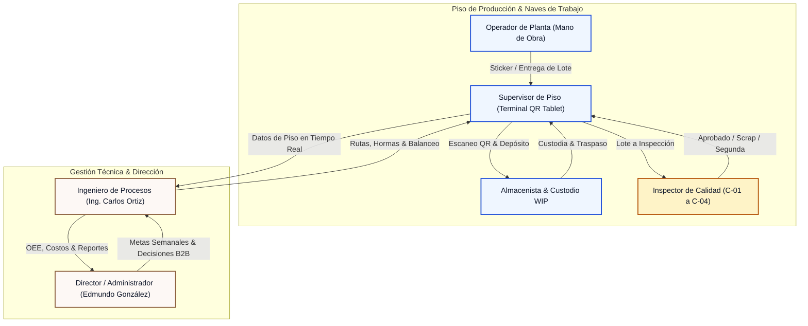
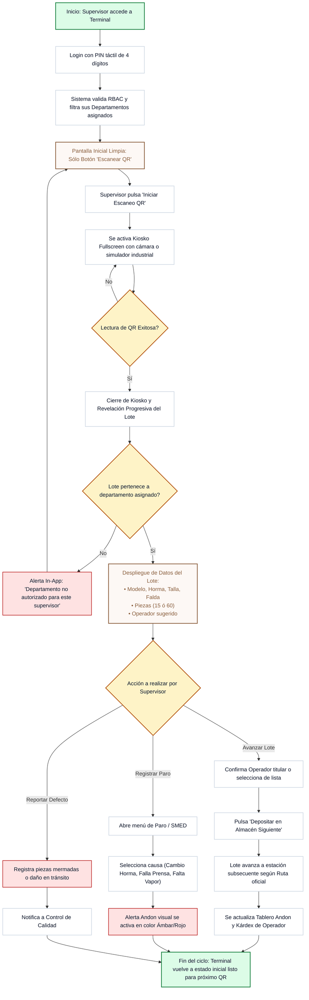
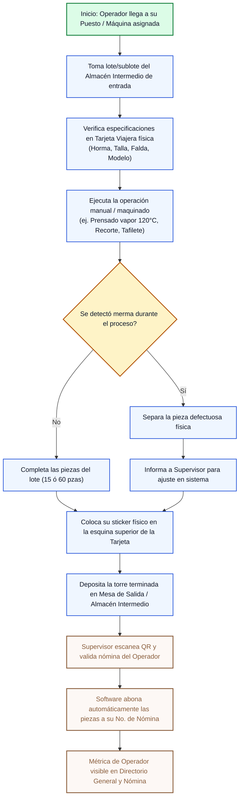
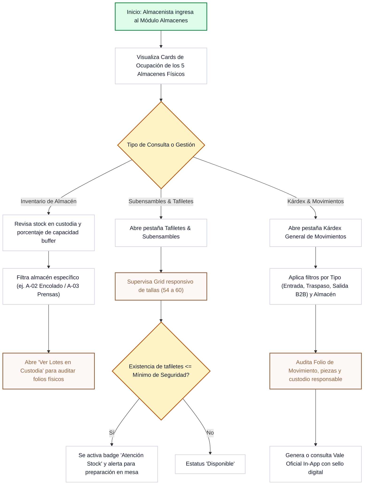
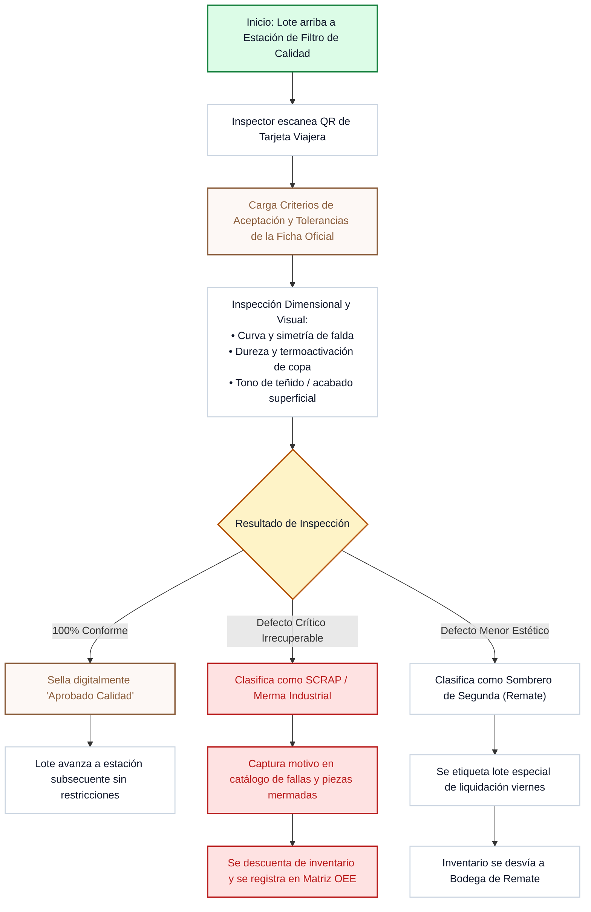
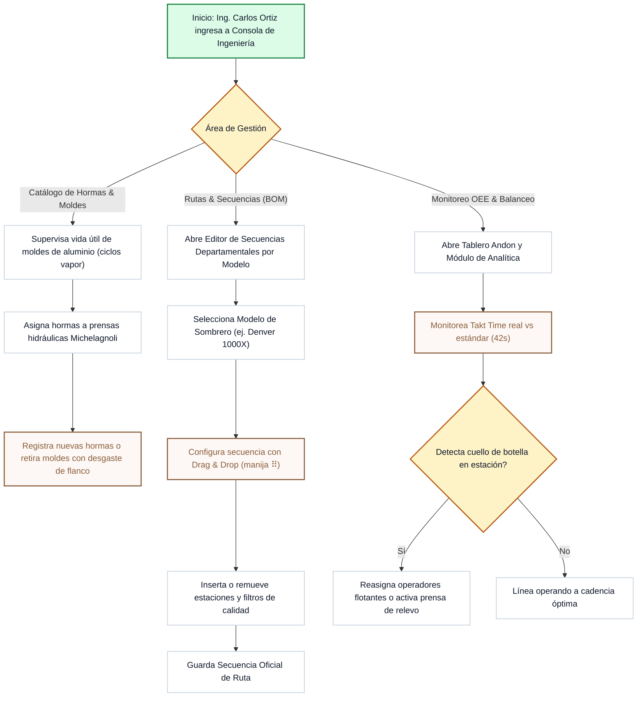
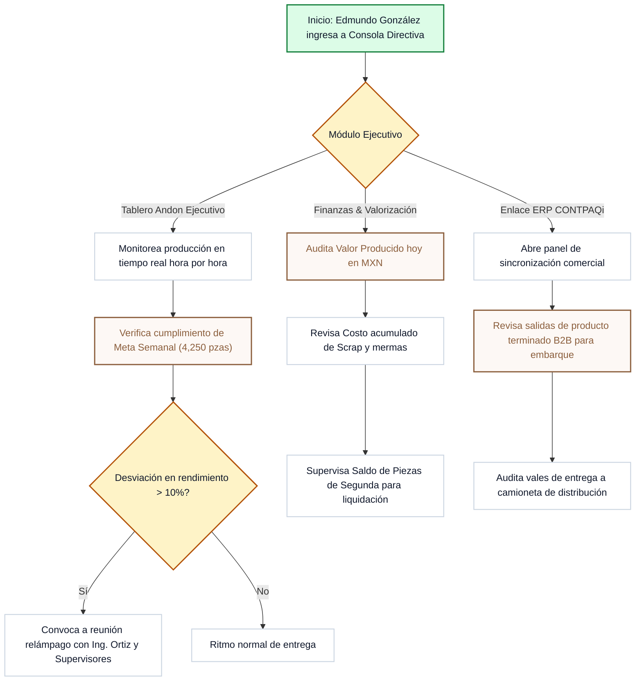

# Tombstone Hats MES · Diagramas de Flujos Principales por Actor / Usuario

> **Documento Oficial de Procesos, Interacción y Flujos de Usuario (User Flows & Architecture)**  
> **Versión del Sistema:** `v2.40.0` | **Fecha:** 2 de Octubre de 2026  
> **Planta Matriz:** San Francisco del Rincón, Guanajuato | **Cliente:** Tombstone Hats  
> **Directiva:** Diagramas de flujo en formato Mermaid estándar para todos los actores clave del sistema MES (Supervisor de Piso, Operador de Planta / Mano de Obra, Almacenista / Logística WIP, Inspector de Calidad, Ingeniero de Procesos y Director General / Administrador).

---

## Índice de Actores y Flujos

1. [Mapa de Actores del Ecosistema MES](#1-mapa-de-actores-del-ecosistema-mes)
2. [Actor 1: Supervisor de Piso (Terminal Tablet / QR Kiosko)](#2-actor-1-supervisor-de-piso-terminal-tablet--qr-kiosko)
3. [Actor 2: Operador de Planta (Mano de Obra / Destajo en Estación)](#3-actor-2-operador-de-planta-mano-de-obra--destajo-en-estación)
4. [Actor 3: Almacenista & Logística WIP (Almacenes Intermedios y Kárdex)](#4-actor-3-almacenista--logística-wip-almacenes-intermedios-y-kárdex)
5. [Actor 4: Inspector de Calidad (Filtros C-01 a C-04 y Segundas)](#5-actor-4-inspector-de-calidad-filtros-c-01-a-c-04-y-segundas)
6. [Actor 5: Ingeniero de Procesos y Planta (Carlos Ortiz)](#6-actor-5-ingeniero-de-procesos-y-planta-carlos-ortiz)
7. [Actor 6: Director General / Administrador (Edmundo González)](#7-actor-6-director-general--administrador-edmundo-gonzález)
8. [Matriz de Interacción Cruzada entre Actores (End-to-End)](#8-matriz-de-interacción-cruzada-entre-actores-end-to-end)

---

## 1. Mapa de Actores del Ecosistema MES



---

## 2. Actor 1: Supervisor de Piso (Terminal Tablet / QR Kiosko)

El Supervisor (`Juan Manuel Pérez`, `Roberto Méndez`) opera en piso con tablet industrial o estación táctil. Su flujo principal es la lectura de la tarjeta viajera, validación de lote y registro de avance departamental.



---

## 3. Actor 2: Operador de Planta (Mano de Obra / Destajo en Estación)

Los operadores de planta (`Salvador Macías`, `Jorge Martínez`, `Melany Luna`, etc.) trabajan directamente en las prensas, mesas de adorno y acabado. **No inician sesión en el software con contraseñas**, pero interactúan físicamente mediante su sticker en la tarjeta viajera física y su número de nómina.



---

## 4. Actor 3: Almacenista & Logística WIP (Almacenes Intermedios y Kárdex)

El Almacenista supervisa la custodia física y digital de los 5 almacenes intermedios (`A-01` Materia Prima a `A-05` Producto Terminado), el inventario de subensambles (tafiletes de piel por talla) y la emisión de vales de traspaso.



---

## 5. Actor 4: Inspector de Calidad (Filtros C-01 a C-04 y Segundas)

El Inspector de Calidad supervisa los 4 filtros estratégicos (`C-01` Inspección Tras Encolado, `C-02` Control Hormado Vapor, `C-03` Revisión Pintura/Matizado y `C-04` Auditoría Final Pre-Empaque).



---

## 6. Actor 5: Ingeniero de Procesos y Planta (Carlos Ortiz)

El Ingeniero gestiona la arquitectura operativa de la fábrica: balanceo de líneas, catálogo maestro de hormas y moldes, rutas por modelo (BOM/Secuencia) y KPIs de OEE.



---

## 7. Actor 6: Director General / Administrador (Edmundo González)

El Director ("Mundo") tiene visión ejecutiva holística. Su enfoque se centra en el cumplimiento de la meta semanal (4,250 pzas), valorización financiera, costos de scrap y vinculación con la empresa comercial (CONTPAQi ERP).



---

## 8. Matriz de Interacción Cruzada entre Actores (End-to-End)

Diagrama de secuencia de interacción integral desde la creación del lote hasta el embarque final:

```mermaid
sequenceDiagram
    autonumber
    actor Ing as Ingeniero (Carlos)
    actor Alm as Almacenista (A-01)
    actor Op as Operador (Piso)
    actor Sup as Supervisor (Terminal QR)
    actor QC as Calidad (Filtro C)
    actor Dir as Director (Edmundo)

    Note over Ing,Dir: 1. PROGRAMACIÓN & PREPARACIÓN
    Ing->>Alm: Emite Orden de Producción & Tarjeta Viajera (60 pzas)
    Alm->>Op: Entrega cuadros de telar cortados + Tarjeta física con mica

    Note over Op,Sup: 2. TRANSFORMACIÓN & DESTAJO
    Op->>Op: Realiza proceso en máquina (Prensado / Hormado vapor)
    Op->>Op: Pega sticker físico con su nombre en la tarjeta
    Op->>Sup: Deja torre terminada en Mesa de Almacén Intermedio

    Note over Sup,QC: 3. LECTURA QR & TRAZABILIDAD
    Sup->>Sup: Inicia Escáner Kiosko Fullscreen en Tablet
    Sup->>Sup: Lee código QR de la tarjeta viajera
    Sup->>Sup: Confirma operador en sistema & pulsa "Depositar"
    
    opt Lote requiere Inspección de Calidad
        Sup->>QC: Turna lote al Filtro C correspondiente
        QC->>QC: Valida tolerancias y sella digitalmente Aprobado
    end

    Note over Sup,Dir: 4. ANDON EN VIVO & DIRECCIÓN
    Sup->>Dir: Avance de piezas se refleja en Tablero Andon & OEE
    Dir->>Dir: Monitorea valor producido en MXN y cumplimiento de Meta
