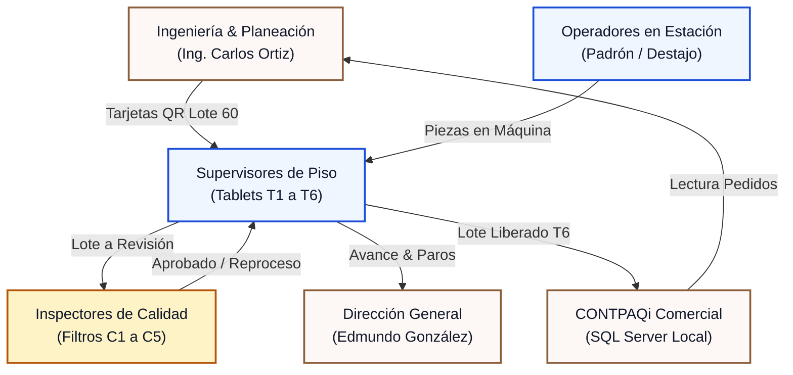
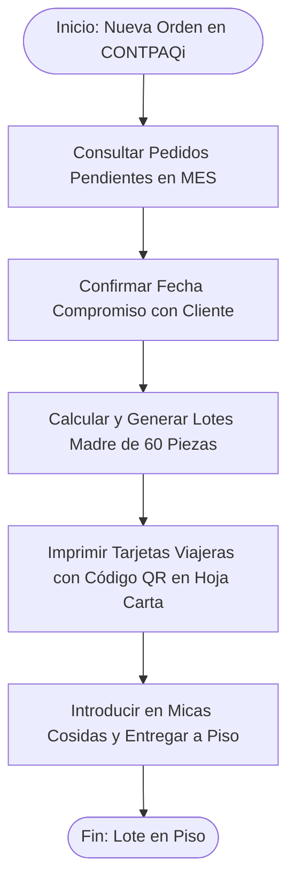
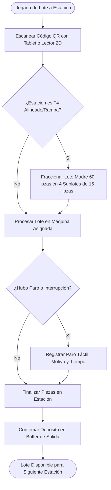
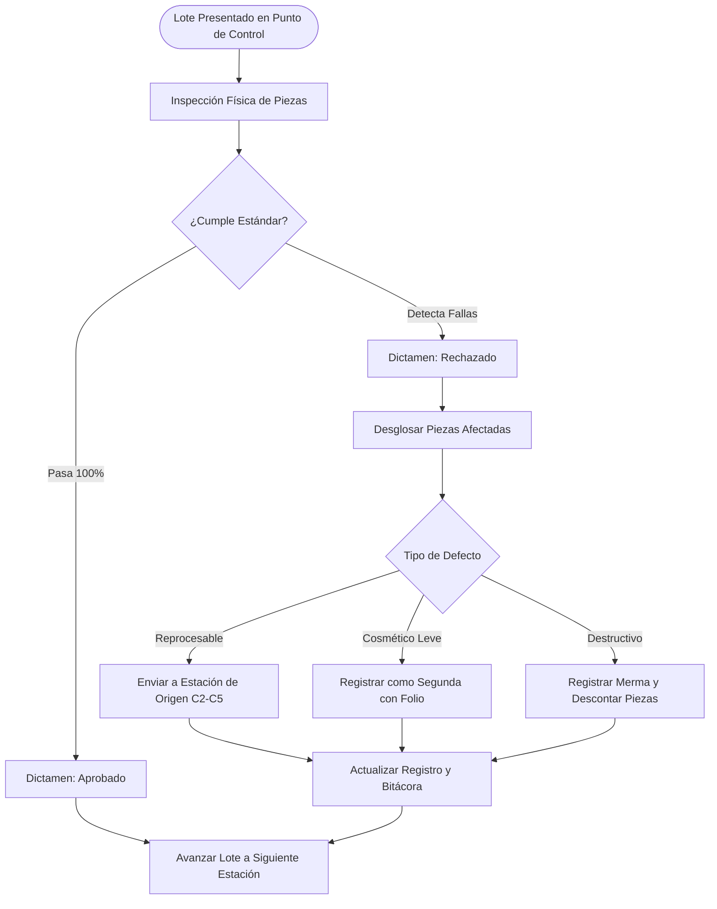
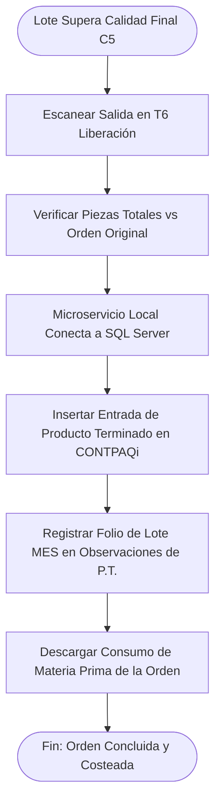

# Flujos de Usuario e Interacción (User Flows) · Alcance Oficial MVP
**Tombstone Hats MES · Control de Planta & Trazabilidad**  
*Mapeo Operativo por Rol y Puntos de Decisión en Planta.*

> **Fecha:** Octubre 2026 | **Versión:** `v2.50.0`  
> **Planta Matriz:** San Francisco del Rincón, Gto. | **Cliente:** Tombstone Hats  
> **Arquitectura:** Flujo Físico-Digital en Turno Único (07:00 - 15:30), Tablets T1 a T6 y Filtros C1 a C5.

---

## 1. Mapa de Actores del Ecosistema

---

## 2. Flujo 1: Ingeniero de Producción (Programación & Tarjetas)

---

## 3. Flujo 2: Supervisor de Piso (Tablets T1 a T6 & Almacenes)

---

## 4. Flujo 3: Inspector de Calidad (Filtros C1 a C5)

---

## 5. Flujo 4: Cierre de Lote y Enlace ERP (T6 a CONTPAQi)

