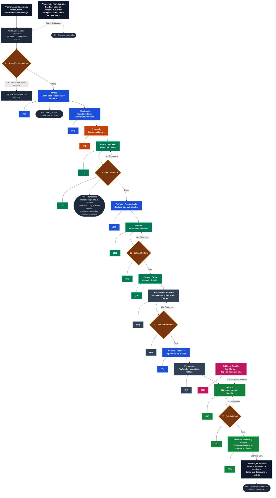

# Diagrama de Flujo del Sistema & Catálogo de Módulos (MVP)
**Tombstone Hats MES · Control de Planta & Trazabilidad**  
*Documento Oficial de Procesos Físicos de Fábrica, Interacción Digital del Software y Catálogo de Módulos.*

> **Versión:** `v2.56.0`  
> **Fecha:** 9 de Octubre de 2026  
> **Estado:** Documento Oficial de Especificación de Procesos y Software  
> **Cliente:** Tombstone Hats (Edmundo González / Ing. Carlos Ortiz)  
> **Proveedor / Arquitectura:** Uanify (Andrés Villanueva)

---

## 1. Alcance General: Operación de Fábrica vs. Funcionalidades del Software MES

Para garantizar total claridad entre el mundo físico de la nave industrial y el sistema digital, este documento desglosa explícitamente:
1. **La Operación Física de la Fábrica:** Qué hacen los operadores, mecánicos, recolectores y supervisores en piso con las máquinas, hormas, carritos y materiales.
2. **Las Funcionalidades del Software MES:** Qué ejecuta el sistema en cada pantalla, qué botones o modales existen, qué cálculos matemáticos realiza, cómo gestiona la base de datos y cómo interactúa con CONTPAQi.

---

## 2. Diagrama de Flujo Oficial de Planta & Arquitectura MES

El siguiente diagrama reproduce con exactitud la arquitectura de flujo aprobada para Tombstone Hats:
- **Colores de Estación (Tablets T1 a T6):** Representa en qué terminal táctil se registra el avance al salir del departamento.
- **Rombos de Calidad (C1 a C5):** Puntos de control donde el Inspector aprueba o rechaza (con flechas rojas de retorno a reproceso).
- **Indicadores Clave (KPIs):** Badges que señalan exactamente en qué punto del flujo nace cada métrica del sistema.
- **Integración CONTPAQi Comercial:** Lectura de órdenes y escritura de salida de producto terminado.

> **Código de Referencia Visual:**
> * **Color Azul (T1):** Prensas y Alambrado (Prensas Unión, Replanchado, Refaldeo).
> * **Color Naranja (T2):** Endopado.
> * **Color Verde Esmeralda (T3):** Pintura (Refuerzo, Pintura, Brillo).
> * **Color Pizarra (T4):** Hidráulicas y Pre-adorno (división en 15 piezas en Almacén Intermedio).
> * **Color Magenta (T5):** Subensambles (Buffer de Tafilete y Toquilla con semáforo de disponibilidad).
> * **Color Verde Bosque (T6):** Adorno, Calidad Final y Embarque.
> * **Rombos Ámbar (C1 a C5):** Puntos de control de calidad; las flechas rojas marcan el regreso a reproceso.
> * **Badges KPI:** Indican exactamente dónde nace cada indicador de desempeño en planta.

---

## 3. Matriz Comparativa: Operación de Fábrica vs. Funcionalidades del Sistema MES

La siguiente tabla describe de forma explícita qué ocurre en la **fábrica física** frente a lo que ejecuta el **sistema digital MES** en cada paso del proceso:

| Paso del Flujo | Operación en la Fábrica (Mundo Físico) | Funcionalidad del Sistema MES (Software Digital) | Hardware & Terminal |
| :--- | :--- | :--- | :--- |
| **0. Programación** | Ingeniería define qué modelos y cantidades se fabricarán durante la semana. | **Módulo de Loteo & Segmentación:** Lee pedidos desde CONTPAQi SQL Server. El usuario segmenta manualmente la orden en Lotes Madre (base 60) y Sublotes (15). El botón de imprimir tarjetas viajeras se bloquea hasta confirmar la segmentación. | PC Oficina Ingeniería |
| **1. Corte & Preparación** | Se cortan lienzos de copa y falda por separado. Aún no existe lote físico porque las partes no se han unido. | **Monitoreo de Materiales:** El sistema audita la salida de materia prima cargada a la orden en CONTPAQi y calcula el *KPI: Costo de Materiales*. | Sin terminal en mesa |
| **2. Calidad C1 (Cuadros)** | Inspector revisa los lienzos cortados antes de pasar a prensado. Si hay defecto, se descarta el lienzo. | **Captura de Mermas de Materia Prima:** Permite registrar metros o piezas descartadas por falla de tela para calcular rendimiento de corte. | Terminal T1 |
| **3. Prensas (Nace el Lote)** | Se unen físicamente la copa y la falda en la prensa caliente con la horma de aluminio montada. Se coloca la **Tarjeta Viajera del Lote Madre (60 piezas)** en la mica del carrito. | **Nacimiento Digital del Lote:** El operador/supervisor escanea el código QR de la tarjeta madre. El sistema activa el lote en estado "En Proceso", asigna la horma montada y comienza a contar tiempos de ciclo. Registra el *KPI: WIP y Piezas Producidas*. Si la prensa se detiene, se activa la **Bitácora Táctil de Paros de Máquina**. | **Tablet T1 (Prensas)** |
| **4. Alambrado** | Operadores recortan falda, colocan alambre y cosen el borde. | **Registro de Avance Departamental:** Al concluir la torre de 60 piezas, el supervisor escanea la salida y el sistema transfiere el lote al almacén de salida de Alambrado. | **Tablet T1 (Prensas)** |
| **5. Endopado** | Baño de engomado con alambre para dar rigidez al sombrero. | **Control de Tiempos de Secado:** Escaneo de entrada y salida del lote en el área de endopado para monitorear el tiempo de permanencia en patio. | **Tablet T2 (Endopado)** |
| **6. Pintura - Refuerzo** | Aplicación de base de refuerzo a pistola en cabina. | **Escaneo de Salida de Refuerzo:** Suma piezas al preconteo de destajo del operador de pistola. | **Tablet T3 (Pintura)** |
| **7. Calidad C2 (Refuerzo)** | Inspector de calidad revisa uniformidad del refuerzo. Si está bien, pasa a replanchado; si tiene defecto, no pasa. | **Filtro de Inspección C2:** El inspector presiona "Aprobar" o "Rechazar". Si rechaza, el sistema abre modal donde el supervisor dictamina: **Reproceso** (flecha roja: el lote regresa digitalmente a Refuerzo), **Segunda** o **Merma**, con registro obligatorio de causa raíz. Alimenta el *KPI: Reprocesos*. | **Tablet T3 (Pintura)** |
| **8. Replanchado** | Prensado con alambre para fijar forma tras el refuerzo. | **Escaneo de Salida Replanchado:** Se valida que el lote superó C2 antes de permitir registrar el replanchado. | **Tablet T1 (Prensas)** |
| **9. Pintura & Calidad C3** | Se aplica la pintura de color al sombrero y el inspector revisa acabado y tono en C3. | **Escaneo de Pintura y Filtro C3:** Aprobación de color o reenvío a reproceso de pintura. Acumula métricas de calidad por cabina. | **Tablet T3 (Pintura)** |
| **10. Pintura - Brillo** | Aplicación de acabado brillante protector. | **Registro de Conclusión de Acabados:** Marca el lote madre de 60 piezas listo para traslado a Hidráulicas. | **Tablet T3 (Pintura)** |
| **11. Hidráulicas (Fraccionamiento)** | **Mesa de Rampa / Hidráulicas:** La torre física de 60 piezas se fracciona en 4 carritos de 15 piezas para permitir secado y moldeo ágil. Se archiva la tarjeta madre y se colocan las 4 tarjetas de sublote en las micas de los carritos. | **Modo Rampa / Fraccionamiento Digital:** El supervisor escanea la tarjeta madre de 60 piezas. El sistema desactiva el lote madre y activa automáticamente los 4 Sublotes individuales de 15 piezas con sus códigos QR independientes. A partir de aquí, cada carrito tiene trazabilidad individual. | **Tablet T4 (Hidráulicas)** |
| **12. Calidad C4 (Hidráulicas)** | Inspector revisa simetría del moldeo hidráulico en cada sublote de 15 piezas. | **Filtro C4 por Sublote:** Aprueba sublotes aptos o regresa el sublote defectuoso a alineado hidráulico sin frenar los otros 3 sublotes. | **Tablet T4 (Hidráulicas)** |
| **13. Refaldeo** | Corte y figura final del ala del sombrero. | **Escaneo de Sublotes en Refaldeo:** Registra operador de refaldeo para destajo y confirma avance hacia pre-adorno. | **Tablet T1 (Prensas)** |
| **14. Pre-adorno** | Perforado de ventilación y pegado inicial de tafilete. | **Escaneo de Sublotes:** Registra salida de pre-adorno y disponibilidad para mesa de adorno. | **Tablet T4 (Hidráulicas)** |
| **15. Subensambles (Tafilete / Toquilla)** | Operadores preparan tafiletes cosidos y toquillas adornadas en mesas independientes. | **Semáforo de Buffer de Ensamble:** Muestra en pantalla el inventario intermedio disponible de tafiletes y toquillas por talla y modelo. Despliega semáforo verde en Adorno cuando hay stock suficiente para procesar la orden sin paros. | **Tablet T5 (Subensambles)** |
| **16. Adorno** | Se cosen tafiletes, toquillas, parches y herrajes según la muestra autorizada. | **Visor de Ficha Técnica Multiperspectiva:** La tablet muestra fotos de alta resolución en varios ángulos del modelo oficial autorizado para que el operador compare la pieza física. Registra operador para destajo. | **Tablet T6 (Adorno / Final)** |
| **17. Calidad C5 (Final)** | Inspector realiza auditoría física al 100% del sombrero terminado. | **Filtro C5 Calidad Final:** Si aprueba, el sublote pasa a Embarque. Si rechaza, el sistema permite redirigir a Adorno o Pintura según el defecto encontrado. Las piezas no recuperables se registran como Segundas (para venta con descuento) o Mermas. | **Tablet T6 (Adorno / Final)** |
| **18. Producto Liberado & Embarque** | Se empacan los 4 sublotes en cajas de 60 piezas, se embalan y se cargan al camión de transporte. | **Módulo de Embarque & Vale de Salida:** Se emite el Vale de Salida Oficial con código QR para entrega al cliente. El sistema liquida la orden en piso y calcula el *KPI: Tiempo de Entrega vs. Fecha Compromiso*. | **Tablet T6 (Adorno / Final)** |
| **19. Cierre en CONTPAQi** | Administración consulta la entrega en el ERP para facturación. | **Conector SQL Local ($0 USD):** El microservicio inserta la entrada de producto terminado en CONTPAQi Comercial con el folio de lote MES en las observaciones y descarga automáticamente las materias primas consumidas. | Servidor Local |

---

## 4. Detalle de los 7 Módulos del Sistema MES

### Módulo 1: Programación, Loteo e Impresión (Ingeniería Admin)
* **Lectura SQL de Pedidos:** Consulta automática de pedidos autorizados en CONTPAQi sin recapturas.
* **Captura de Fecha Compromiso:** Establece la fecha meta para proyectar el semáforo de entrega.
* **Segmentación Manual Obligatoria:** Permite al Ingeniero definir el número de lotes madre (60 pzas) y sublotes (15 pzas) según la orden. El sistema bloquea la impresión de códigos QR hasta que la segmentación es confirmada.
* **Generador de Tarjetas Viajeras en PDF Carta:** Exporta la plantilla de tarjetas con códigos QR de alta densidad, especificación de horma, modelo y talla listas para imprimir en impresora láser de oficina y recortar.

### Módulo 2: Monitoreo Andon & Tablero Ejecutivo (Piso de Planta)
* **WIP en Tiempo Real:** Visualización gráfica de piezas acumuladas en cada almacén intermedio entre departamentos.
* **Tablero de 5 KPIs Rectores:**
  1. *Avance Real vs. Programado por Orden*.
  2. *WIP Activo y Piezas Producidas por Área*.
  3. *Costo de Materiales vs. BOM*.
  4. *Mapeo de Reprocesos con Causa Raíz*.
  5. *Tiempo de Entrega vs. Fecha Compromiso*.
* **Semáforos Visuales:** Alertas inmediatas en pantalla sin ruidos ni bocinas molestas.

### Módulo 3: Terminal Táctil de Piso (Tablets T1 a T6)
* **Diseño Ergonómico Tablet-First:** Botones e inputs de más de 42px diseñados para operarse con guantes o dedos con polvo.
* **Lector QR de Pantalla Completa:** Lectura instantánea utilizando la cámara trasera de la tablet o escáner 2D USB/Bluetooth en modo emulación teclado.
* **Modo Rampa (Fraccionamiento en T4):** Asistente paso a paso para desactivar el lote madre de 60 piezas y dar de alta los 4 sublotes de 15 piezas con un solo toque.
* **Bitácora Táctil de Paros de Máquina:** Cronómetro táctil para registrar detenciones en Prensas indicando número de máquina, operador y motivo (cambio de horma, falla mecánica, falta de vapor o falta de material).

### Módulo 4: Filtros de Calidad y No Conformidades (C1 a C5)
* **Terminal de Aprobación Rápida:** Botones de "Aprobar" y "Rechazar" para inspectores de calidad exclusivos.
* **Dictamen de Rechazo:** Modal exclusivo para Supervisor o Ingeniero de Calidad para definir:
  * *Reproceso:* Retorno digital a la estación causante (flechas rojas del diagrama).
  * *Segunda:* Desvío a almacén de remate registrando causa raíz para KPIs.
  * *Merma:* Desecho definitivo de piezas con afectación a costos.

### Módulo 5: Subensambles (T5) y Ficha Técnica Multiperspectiva
* **Semáforo de Buffer en Adorno:** Monitoreo visual de stock de tafiletes y toquillas para garantizar que Adorno no inicie un lote si faltan componentes.
* **Ficha Técnica Visual con Fotos Oficiales:** Visor de imágenes en alta resolución mostrando la muestra física aprobada desde múltiples perspectivas (armado, doblado, costura y herraje).

### Módulo 6: Pre-Nómina de Destajo y Reportes Administrativos
* **Cálculo Automático por Operador:** Multiplica piezas concluidas por la tarifa fija ($/pza) de cada área.
* **Exportación Directa a Excel:** Generación del reporte de corte semanal de los viernes en formato `.xlsx` limpio y sin macros para RH y Nóminas.

### Módulo 7: Conector Puente CONTPAQi Comercial SQL Server
* **Integración Nativa ($0 USD Licencias SDK):** Lee pedidos y materias primas mediante vistas SQL y registra la entrada de producto terminado escribiendo el folio del lote MES en las observaciones de CONTPAQi.
