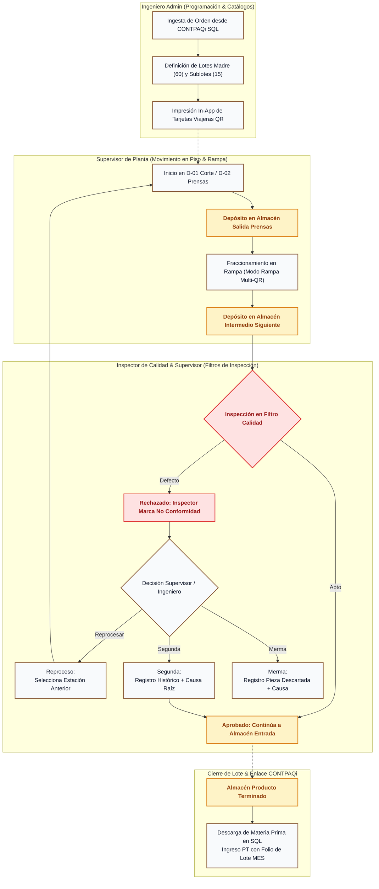

# Diagrama de Flujo del Sistema & Catálogo de Módulos (MVP)
**Tombstone Hats MES · Control de Planta & Trazabilidad**  
*Documento Oficial de Procesos, Flujo por Rol y Arquitectura Modular.*

> **Fecha:** 7 de Octubre de 2026  
> **Cliente:** Tombstone Hats (San Francisco del Rincón, Guanajuato)  
> **Líder de Proyecto:** Andrés Villanueva (Uanify)

---

## 1. Diagrama de Flujo General del Sistema (End-to-End)

---

## 2. Catálogo de Módulos y Funcionalidades del Sistema

### Módulo 1: Programación, Loteo e Impresión (Ingeniería Admin)
* **Ingesta de Órdenes:** Lectura directa de órdenes de producción activas en la base de datos Microsoft SQL Server de CONTPAQi Comercial.
* **Partición y Creación de Lotes:** Pantalla para programar el volumen de la orden, definiendo lotes madre y número de sublotes según la planeación semanal.
* **Centro de Impresión de Tarjetas:** Generación e impresión directa de tarjetas viajeras con códigos QR en hojas tamaño carta estándar de oficina para recortar e introducir en fundas plásticas cosidas.

### Módulo 2: Monitoreo de Piso y WIP por Almacén Intermedio
* **Avance Real vs. Programado:** Indicador visual en tiempo real de piezas completadas frente a la meta programada por cada orden de producción.
* **Mapa de Almacenes Intermedios:** Visualización en vivo del inventario en proceso (WIP) depositado en cada buffer y almacén entre estaciones de trabajo.
* **Bitácora Mínima del Lote:** Consulta rápida del historial de movimientos, hora exacta, estación y usuario responsable del depósito de cada lote o sublote.

### Módulo 3: Terminal Táctil de Piso (Supervisores)
* **Escaneo de Lotes:** Identificación de tarjeta viajera mediante cámara integrada de la tablet (Xiaomi Redmi Pad SE / Samsung) o lector óptico industrial 2D (Opción B).
* **Registro de Depósito:** Confirmación de depósito en el almacén intermedio correspondiente al concluir el trabajo en la estación.
* **Modo Rampa (Fraccionamiento Multi-QR):** Escaneo en lote para archivar la tarjeta madre de 60 piezas y activar formalmente los códigos QR de los sublotes de 15 piezas.
* **Captura de Paros de Máquina:** Registro ágil de paros productivos con motivo de catálogo táctil (cambio de horma, falla mecánica, falta de vapor, falta de material) y tiempos de detención.

### Módulo 4: Puntos de Control de Calidad e Inspección
* **Validación de Filtro:** Inspección física por parte del Inspector de Calidad con dos opciones directas: Aprobar o Rechazar.
* **Resolución de Rechazos (Supervisor / Ingeniero):**
  * Asignación manual de estación de retorno para **Reprocesos**.
  * Captura de piezas y causa raíz para **Segundas** (histórico para KPIs).
  * Captura de piezas y motivo para **Mermas** (histórico para KPIs).

### Módulo 5: Subensambles y Ficha Técnica Multiperspectiva
* **Semáforo de Buffer en Adorno:** Monitoreo visual de disponibilidad de inventario intermedio en subensambles (Tafiletes y Toquillas) para evitar paros en Adorno.
* **Ficha Técnica Visual con Fotos Oficiales:** Despliegue en pantalla de varias fotografías de la muestra oficial autorizada del sombrero (almacenadas en AWS S3) en diferentes perspectivas (armado, doblado, toquilla, herraje) para comparación física en Adorno e Inspección Final.

### Módulo 6: Pre-Nómina de Destajo y Reportes
* **Cálculo de Destajo Semanal:** Acumulado automático de piezas concluidas por operador con base en su tarifa fija ($/pza).
* **Exportación Administrativa:** Descarga en un clic en formato nativo Microsoft Excel para conciliación de nómina.

### Módulo 7: Microservicio Puente CONTPAQi SQL Server
* **Integración Local ($0 Licencias SDK):** Vistas y Procedimientos Almacenados en Microsoft SQL Server dentro de red local para sincronizar catálogos, registrar entrada de producto terminado con el folio del lote MES en observaciones y descargar materia prima consumida.
