# Diagrama de Flujo del Sistema & Catálogo de Módulos (MVP)
**Tombstone Hats MES · Control de Planta & Trazabilidad**  
*Documento Ejecutivo para Cliente y Planta: Cómo Funciona el Sistema MES y su Empate con la Producción Real.*

> **Versión:** `v2.59.0`  
> **Fecha:** 9 de Octubre de 2026  
> **Estado:** Documento Oficial de Especificación de Procesos y Software  
> **Cliente:** Tombstone Hats (Edmundo González / Ing. Carlos Ortiz)  
> **Proveedor / Arquitectura:** Uanify (Andrés Villanueva)

---

## 1. Resumen Ejecutivo: ¿Qué hace el Sistema MES en la Fábrica?

El **Tombstone Hats MES** es el cerebro operativo que digitaliza el piso de planta y conecta la administración (CONTPAQi) con el trabajo diario de los operadores:

* **Elimina recapturas y errores:** Toma los pedidos directo de CONTPAQi y permite planear la producción semanal.
* **Controla el avance físico con Códigos QR:** Sigue el sombrero desde que se unen copa y falda en Prensas hasta que se empaca en Embarque.
* **Controla cuellos de botella y almacenes intermedios:** Muestra en vivo cuántas piezas hay esperando en cada área de la fábrica (WIP).
* **Resuelve fallas y calidad sin detener la línea:** Permite desviar piezas con defecto a Reproceso, Segunda o Merma con causa justificada, mientras las piezas buenas siguen avanzando.
* **Genera pre-nómina de destajo automática:** Calcula las piezas concluidas por cada operario según su tarifa en pesos, exportable a Excel en un clic.

---

## 2. Diagrama de Flujo Ejecutivo: Fábrica Física + Capacidades del Sistema MES

Este diagrama muestra las fases de la producción, cómo interactúa el operador en la nave física y qué herramientas y funciones alternas tiene el sistema MES en cada punto:

```mermaid
flowchart TD
    classDef erp fill:#0F172A,stroke:#334155,stroke-width:2px,color:#FFFFFF,font-weight:bold;
    classDef mesMain fill:#1D4ED8,stroke:#3B82F6,stroke-width:2px,color:#FFFFFF,font-weight:bold;
    classDef fabrica fill:#334155,stroke:#64748B,stroke-width:2px,color:#FFFFFF;
    classDef calidad fill:#9A3412,stroke:#F97316,stroke-width:2px,color:#FFFFFF,font-weight:bold;
    classDef alterno fill:#581C87,stroke:#A855F7,stroke-width:2px,color:#FFFFFF,font-weight:bold;
    classDef kpi fill:#064E3B,stroke:#10B981,stroke-width:1px,color:#ECFDF5;

    %% FASE 1: PLANEACIÓN
    subgraph FASE1 ["FASE 1: Planificación, Loteo e Impresión"]
        ERP_IN[("CONTPAQi Comercial<br>Pedidos autorizados y materiales")]:::erp
        MES_PLAN["[MES] Módulo de Ingeniería<br>&bull; Lectura de Pedidos SQL<br>&bull; Segmentación de Lotes y Sublotes<br>&bull; Captura de Fecha Compromiso<br>&bull; Generación de Tarjetas Viajeras con QR<br>&bull; Bloqueo de impresión hasta segmentar"]:::mesMain
       
        ERP_IN -->|"Lectura automática"| MES_PLAN
    end

    %% FASE 2: NACIMIENTO Y TRAMO TORRE
    subgraph FASE2 ["FASE 2: Nacimiento del Lote y Tramo Inicial"]
        CORTE["[Fábrica] Corte y Preparación<br>Copa y falda por separado"]:::fabrica
        PRENSAS["[Fábrica] Prensas Calientes<br>Unión copa y falda con horma montada"]:::fabrica
       
        MES_PISO1["[MES] Terminal de Prensas<br>&bull; Escaneo QR de nacimiento de lote<br>&bull; Asignación de Horma a máquina<br>&bull; Depósito en almacén de salida"]:::mesMain

        PARO["[MES FUNCIONALIDAD ALTERNA]<br>Bitácora Táctil de Paros de Máquina<br>&bull; Registro de causa de detención<br>&bull; Cronómetro en vivo de tiempo muerto"]:::alterno

        TRAMO_INICIAL["[Fábrica] Alambrado, Endopado y Pintura<br>Avance físico en torres"]:::fabrica

        MES_PLAN --> CORTE --> PRENSAS
        PRENSAS <--> MES_PISO1
        PRENSAS -.->|"Si máquina se detiene"| PARO
        PRENSAS --> TRAMO_INICIAL
    end

    %% FASE 3: FRACCIONAMIENTO EN RAMPA
    subgraph FASE3 ["FASE 3: Mesa de Rampa y Fraccionamiento (Almacén D-05)"]
        RAMPA_FIS["[Fábrica] Mesa de Rampa<br>La torre se divide en sublotes<br>para moldeado y secado ágil"]:::fabrica
       
        MES_RAMPA["[MES] Modo Rampa en Terminal<br>&bull; Escaneo de Tarjeta Viajera de Lote<br>&bull; Software desactiva Tarjeta de Lote<br>&bull; Software activa Sublotes<br>&bull; Habilita trazabilidad individual"]:::mesMain

        TRAMO_INICIAL --> RAMPA_FIS
        RAMPA_FIS <--> MES_RAMPA
    end

    %% FASE 4: ENSAMBLE, CALIDAD Y DESPACHO
    subgraph FASE4 ["FASE 4: Ensamble, Filtros de Calidad y Embarque"]
        HID_ADORNO["[Fábrica] Hidráulicas, Pre-adorno y Adorno<br>Armado final del sombrero"]:::fabrica

        SUB_BUF["[MES FUNCIONALIDAD ALTERNA]<br>Semáforo de Subensambles (Tafiletes y Toquillas)<br>&bull; Monitoreo de stock intermedio<br>&bull; Semáforo VERDE en Adorno para ensamblar<br>&bull; Semáforo ROJO si faltan insumos"]:::alterno

        FICHA_FOTO["[MES FUNCIONALIDAD ALTERNA]<br>Ficha Técnica con Fotos Oficiales<br>&bull; Galería de fotos<br>&bull; Comparación visual en pantalla del modelo<br>autorizado contra la pieza física"]:::alterno

        CALIDAD_GATE{"[MES] Filtros de Calidad (C1 a C5)<br>Inspector: ¿Aprobado?"}:::calidad

        RECHAZO_FLOW["[MES RESOLUCIÓN DE CALIDAD]<br>&bull; Reproceso: Retorno a estación causante<br>&bull; Segunda: Venta directa con descuento<br>&bull; Merma: Registro de causa raíz y desecho<br>(El lote conforme sigue su avance sin frenarse)"]:::calidad

        EMBARQUE["[Fábrica] Empaque y Embarque<br>Reagrupación en cajas"]:::fabrica

        MES_SALIDA["[MES] Despacho y Cierre<br>&bull; Generación de Vale de Salida con QR<br>&bull; Liquidación de Orden en piso<br>&bull; Cálculo automático de Destajo (Excel)"]:::mesMain

        ERP_OUT[("CONTPAQi Comercial<br>&bull; Entrada de Producto Terminado<br>&bull; Folio MES en Observaciones<br>&bull; Descarga de Materia Prima")]:::erp

        RAMPA_FIS --> HID_ADORNO
        SUB_BUF -.->|"Alimenta insumos"| HID_ADORNO
        FICHA_FOTO -.->|"Guía visual"| HID_ADORNO
        HID_ADORNO --> CALIDAD_GATE
        CALIDAD_GATE -->|"Sí: Pasa"| EMBARQUE
        CALIDAD_GATE -.->|"No: Rechazo"| RECHAZO_FLOW
        RECHAZO_FLOW -.->|"Retorno"| HID_ADORNO
        EMBARQUE <--> MES_SALIDA
        MES_SALIDA -->|"Escritura SQL ($0 USD)"| ERP_OUT
    end

    %% MONITOREO EJECUTIVO TRANSVERSAL
    subgraph ANDON ["TABLERO DIRECTIVO EN VIVO (ANDON)"]
        KPI_WIP(["KPI 1: Inventario WIP por Almacén"]):::kpi
        KPI_PROD(["KPI 2: Avance Real vs Programado"]):::kpi
        KPI_QUAL(["KPI 3: Segundas, Mermas y Reprocesos"]):::kpi
        KPI_PARO(["KPI 4: Paros y Tiempos Muertos de Prensa"]):::kpi
        KPI_TIME(["KPI 5: Semáforo de Entrega vs Fecha Compromiso"]):::kpi
    end

    MES_PISO1 -.-> ANDON
    MES_RAMPA -.-> ANDON
    CALIDAD_GATE -.-> ANDON
    PARO -.-> ANDON
    MES_SALIDA -.-> ANDON
```

---

## 3. Funcionalidades Alternas y de Soporte del Sistema MES

Además del camino estándar de avance de lotes, el sistema cuenta con módulos diseñados para resolver contingencias operativas en la fábrica:

1. **Bitácora Táctil de Paros de Máquina**
   * **Dónde opera:** En terminales de Prensas y estaciones críticas de planta.
   * **Propósito:** Registrar tiempos muertos de inicio a fin cuando una máquina se detiene.
   * **Catálogo de Motivos Táctil:** Múltiples opciones para registrar la causa del Paro.
   * **Impacto:** Alimenta el KPI de Tiempos Muertos en el Tablero Andon para que se identifiquen máquinas problemáticas.

2. **Semáforo de Buffer de Subensambles (Tafiletes y Toquillas)**
   * **Dónde opera:** En el área de Adorno y estaciones de costura de accesorios.
   * **Propósito:** Evitar que los operadores de Adorno inicien un lote de sombreros si el área de tafiletes o toquillas no ha terminado los insumos de esa talla.
   * **Visualización:**
     * 🟢 **Verde:** Stock completo (más de N piezas disponibles de esa talla).
     * 🟡 **Amarillo:** Stock parcial (insumos en proceso).
     * 🔴 **Rojo:** Sin existencias (línea detenida por falta de subensamble).

3. **Ficha Técnica Multiperspectiva con Fotos Oficiales**
   * **Dónde opera:** En Adorno e Inspección Final de Calidad.
   * **Propósito:** Garantizar que el armado de adornos, herrajes y doblado de toquillas sea idéntico a la muestra física aprobada.
   * **Visualización:** Despliega en pantalla fotos oficiales tomadas desde múltiples ángulos.

4. **Flujo de Segundas y Mermas sin Detener la Línea**
   * **Dónde opera:** En todos los puntos de inspección y terminales de salida.
   * **Propósito:** Registrar piezas defectuosas retiradas de la torre sin congelar el lote.
   * **Manejo:** El lote continúa con las piezas conformes restantes; las piezas defectuosas se clasifican como "Segunda" o "Merma", asociando siempre la causa raíz del defecto.

5. **Pre-Nómina Automatizada a Destajo y Exportación Excel**
   * **Manejo:** El sistema suma las piezas registradas por número de nómina en cada estación, aplica la tarifa en pesos ($/pza) y genera la tabla de corte semanal de los viernes con descarga inmediata a Excel.

---

## 4. Catálogo Detallado de los 7 Módulos del Sistema MES (MVP)

* **Módulo 1: Programación, Loteo e Impresión (Ingeniería Admin)**
  * **Lectura SQL de Pedidos:** Consulta automática de pedidos autorizados en CONTPAQi sin recapturas.
  * **Captura de Fecha Compromiso:** Establece la fecha meta para proyectar el semáforo de entrega.
  * **Segmentación Manual Obligatoria:** Permite al Ingeniero definir el número de lotes y sublotes. El sistema permite la impresión de códigos QR hasta que la segmentación fue confirmada.
  * **Generador de Tarjetas Viajeras en PDF Carta:** Exporta la plantilla de tarjetas con códigos QR e información del Lote listas para imprimir y recortar.

* **Módulo 2: Monitoreo Andon & Tablero Ejecutivo (Piso de Planta)**
  * **WIP en Tiempo Real:** Visualización gráfica de piezas acumuladas en cada almacén intermedio entre departamentos.
  * **Tablero de 5 KPIs Rectores:**
    * Avance Real vs. Programado por Orden.
    * WIP Activo y Piezas Producidas por Área.
    * Costo de Materiales vs. BOM.
    * Mapeo de Reprocesos con Causa Raíz.
    * Tiempo de Entrega vs. Fecha Compromiso.
  * **Semáforos Visuales:** Alertas inmediatas en pantalla.

* **Módulo 3: Terminal Táctil de Piso (Tablets T1 a T6)**
  * **Diseño Ergonómico Tablet-First:** Botones e inputs optimizados para uso de Tabletas.
  * **Lector QR de Pantalla Completa:** Lectura instantánea utilizando la cámara trasera de la tablet.
  * **Modo Rampa (Fraccionamiento):** Asistente paso a paso para desactivar el lote y dar de alta los sublotes.
  * **Bitácora Táctil de Paros de Máquina:** Cronómetro para registrar detenciones en Prensas indicando número de máquina, operador y motivo.

* **Módulo 4: Filtros de Calidad y No Conformidades (C1 a C5)**
  * **Terminal de Aprobación:** Botones de "Aprobar" y "Rechazar" para inspectores de calidad.
  * **Dictamen de Rechazo:** Modal exclusivo para Supervisor o Ingeniero de Calidad para definir:
    * Reproceso: Retorno digital a la estación causante.
    * Segunda: Desvío a almacén de remate registrando causa raíz para KPIs.
    * Merma: Desecho definitivo de piezas con afectación a costos.

* **Módulo 5: Subensambles y Fichas Técnicas Multiperspectiva**
  * **Semáforo de Suministro para Adorno:** Monitoreo visual de stock de tafiletes y toquillas para garantizar que Adorno no inicie un lote si faltan componentes.
  * **Ficha Técnica Visual con Fotos Oficiales:** Visor de imágenes mostrando la muestra física aprobada desde múltiples perspectivas (armado, doblado, costura y herraje).

* **Módulo 6: Pre-Nómina de Destajo y Reportes Administrativos**
  * **Cálculo Automático por Operador:** Multiplica piezas concluidas por la tarifa fija ($/pza) de cada área.
  * **Exportación Directa a Excel:** Generación del reporte de corte semanal de los viernes en formato .xlsx limpio.

* **Módulo 7: Conector Puente CONTPAQi Comercial SQL Server**
  * **Integración Nativa ($0 USD Licencias SDK):** Lee pedidos y materias primas mediante vistas SQL y registra la entrada de producto terminado escribiendo el folio del lote MES en las observaciones de CONTPAQi.
