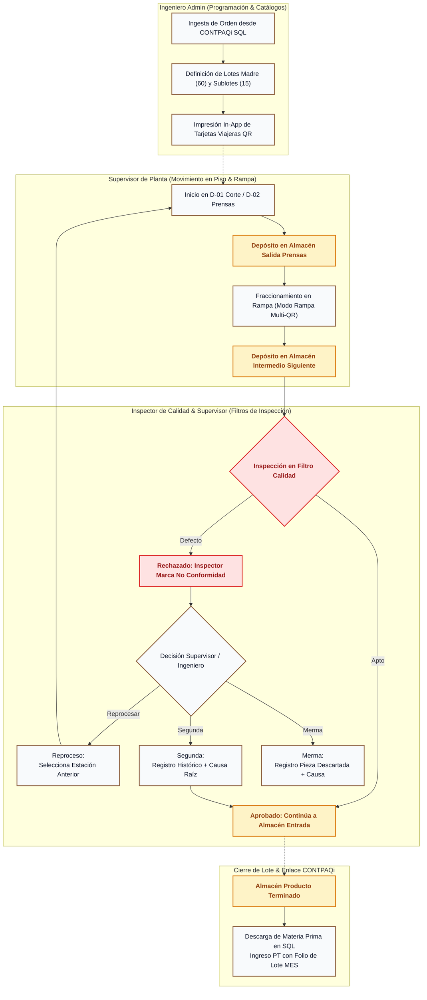

# Diagrama de Flujo del Sistema & Catálogo de Módulos (MVP)
**Tombstone Hats MES · Control de Planta & Trazabilidad**  
*Documento Oficial de Procesos, Flujo por Rol y Arquitectura Modular.*

> **Versión:** `v2.44.0`  
> **Fecha:** 7 de Octubre de 2026  
> **Estado:** Documento Oficial de Entrega  
> **Cliente:** Tombstone Hats  
> **Proveedor:** Uanify

---

## 1. Diagrama de Flujo General del Sistema (End-to-End)

---

## 2. Catálogo de Módulos y Funcionalidades del Sistema

### Módulo 1: Programación, Loteo e Impresión (Ingeniería Admin)
* **Ingesta de Órdenes:** Lectura directa de órdenes de producción activas en la base de datos Microsoft SQL Server de CONTPAQi.
* **Partición y Creación de Lotes:** Pantalla para programar el volumen de la orden, definiendo lotes madre y número de sublotes.
* **Centro de Impresión de Tarjetas:** Generación de formatos estándar en papel carta listos para recortar e introducir en micas viajeras de piso con códigos QR.

### Módulo 2: Monitoreo de Piso y WIP por Almacén
* **Avance Real vs. Programado:** Medidor visual de piezas completadas frente a las requeridas por cada orden activa.
* **Mapa de Almacenes Intermedios:** Visualización en tiempo real del inventario en proceso (WIP) depositado en cada buffer y almacén entre estaciones.
* **Bitácora Mínima del Lote:** Consulta rápida del historial de movimientos, hora y usuario que depositó cada lote o sublote.

### Módulo 3: Terminal Táctil de Piso (Supervisores)
* **Escaneo de Lotes:** Identificación de tarjeta viajera mediante cámara integrada o lector óptico industrial.
* **Registro de Depósito:** Confirmación de depósito en el almacén intermedio correspondiente.
* **Modo Rampa (Fraccionamiento Multi-QR):** Escaneo en lote para desactivar la tarjeta madre y activar los códigos QR de los sublotes de 15 piezas.
* **Captura de Paros de Máquina:** Registro de tiempo improductivo indicando operador, máquina y motivo de falla.

### Módulo 4: Puntos de Control de Calidad e Inspección
* **Validación de Filtro:** Aprobación o rechazo de piezas en los puntos oficiales de revisión.
* **Resolución de Rechazos (Supervisor / Ingeniero):**
  * Asignación manual de estación de retorno para **Reprocesos**.
  * Captura de piezas y causa raíz para **Segundas** (histórico).
  * Captura de piezas y motivo para **Mermas** (histórico).

### Módulo 5: Pre-Nómina de Destajo y Reportes
* **Cálculo de Destajo Semanal:** Conteo acumulado de piezas procesadas por cada operador fijo con su tarifa asignada ($/pza).
* **Exportación Administrativa:** Descarga en un clic en formato Microsoft Excel para nómina.

### Módulo 6: Microservicio Puente CONTPAQi SQL Server
* **Integración Local:** Vistas y Stored Procedures en SQL Server para sincronizar catálogos, registrar salida de producto terminado con folio de lote MES y descontar consumos de materia prima.
