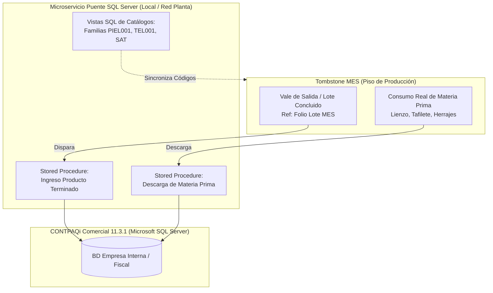

# Propuesta Técnica y Arquitectura Operativa · MES Tombstone Hats
**Estrategia de Digitalización y Control de Manufactura · Uanify**  
*Documento de Especificación de Alcance, Procesos de Piso y Modelo Operativo.*

> **Fecha:** 7 de Octubre de 2026  
> **Cliente:** Tombstone Hats (San Francisco del Rincón, Guanajuato)  
> **Líder de Proyecto:** Andrés Villanueva (Uanify)

---

## 1. Resumen Ejecutivo y Enfoque Estratégico ($0 Costo en Licenciamiento Externo)

La presente propuesta define la arquitectura, flujos operativos y alcance funcional del **Sistema MES (Manufacturing Execution System) para Tombstone Hats**, digitalizando la producción desde que copa y falda se unen en Prensas hasta la entrega al cliente, y conectándolo con CONTPAQi Comercial 11.3.1.

El objetivo central es que Dirección e Ingeniería visualicen en tiempo real los **5 Indicadores Clave de Desempeño (KPIs)** solicitados por la planta:

| KPI | Pregunta de Negocio que Responde | Origen del Dato en Piso | Consulta en Sistema |
|:---|:---|:---|:---|
| **Inventario en Proceso (WIP)** | ¿Cuántos sombreros hay hoy en cada departamento y a qué orden pertenecen? | Escaneo de tarjeta viajera al depositar en almacén intermedio | Por departamento, orden, modelo y talla |
| **Piezas Producidas por Área** | ¿Cuánto produjo cada departamento en el día y en la semana? | Escaneo de salida del departamento | Por día, semana, departamento y operador |
| **Consumo de Materiales** | ¿Cuánto material consumió realmente cada orden contra su lista estándar? | Salidas de almacén cargadas a la orden vs lista de materiales (BOM) en CONTPAQi | Por orden, modelo e insumo |
| **Reprocesos y Defectos** | ¿Cuántas piezas regresaron, desde qué punto de calidad y por qué causa raíz? | Registro del inspector en los 5 puntos de calidad con dictamen de supervisor | Por punto de calidad, causa y departamento origen |
| **Tiempo de Entrega** | ¿Cada pedido llegará a tiempo respecto a la fecha compromiso acordada? | Fecha compromiso capturada al crear la orden + registro de entrega final | Por pedido, cliente y semana |

*Nota sobre materiales y reprocesos:* El control de materiales mide el consumo en unidades físicas contra la lista de materiales (BOM); la valorización monetaria se calcula con base en los costos unitarios registrados en CONTPAQi. Los reprocesos se contabilizan en piezas y causa raíz sin recosteo contable en esta fase. El tablero alerta en amarillo los pedidos próximos al vencimiento y en rojo los atrasados.

### Directrices Rectoras de la Estrategia (2 Opciones):
* **Opción A (Recomendada):** Sistema MES Integral con enlace nativo a Microsoft SQL Server de CONTPAQi Comercial 11, trazabilidad por códigos QR en tarjetas viajeras y monitoreo de WIP por almacén intermedio. Operado en tablets/pantallas táctiles utilizando la cámara integrada del dispositivo.
* **Opción B (Con Hardware de Escaneo):** Todo el alcance de la Opción A, complementado con kits de lectores ópticos industriales 2D (código QR) vía USB/Bluetooth en modo emulación teclado (HID) montados en estaciones clave para acelerar el escaneo continuo.

---

## 2. Ingesta de Órdenes, Creación de Lotes e Impresión de Tarjetas

* **Inicio del Seguimiento:**  
  El lote nace formalmente en el MES cuando copa y falda se unen en **Prensas (T1)**. El proceso previo (Corte, Endopado y Entallado de lienzos) no se rastrea con lote individual en piso, pero sí se carga su consumo de materia prima a la orden de producción.
* **Emisión de Tarjetas Directa en Planta:**  
  El Ingeniero Admin consulta en el MES la orden proveniente de CONTPAQi Comercial. Asigna manualmente la cantidad de lotes madre (base 60 pzas) y sublotes (15 pzas) conforme a la programación. Desde la misma pantalla genera e imprime las tarjetas viajeras oficiales con sus códigos QR en hojas tamaño carta estándar de oficina para recortar e introducirlas en fundas plásticas cosidas.
* **División en Sublotes en Hidráulicas (T4):**  
  El lote viaja como lote madre de 60 piezas desde Prensas hasta Alineado en Hidráulicas (T4), donde se divide formalmente en sublotes de 15 piezas mediante escaneo para transitar por acabados hasta Producto Liberado. El número de sublotes es configurable por orden.
* **Momento del Escaneo:**  
  Se realiza al salir del departamento por el usuario/supervisor que concluye el proceso al depositar el lote en el almacén intermedio para el siguiente proceso. Con ello, el lote sale del WIP de un departamento e ingresa al inventario del siguiente.

---

## 3. Puntos de Control de Calidad, Rechazos y Piezas de Segunda

### 3.1 Estructura de Decisión en Filtros de Calidad:
El **Inspector de Calidad** valida físicamente las piezas en los filtros oficiales y tiene únicamente dos acciones: **Aprobar** o **Rechazar**. Ante una no conformidad, el Supervisor o el Ingeniero de Calidad dictamina en pantalla:
* **Reproceso:** Selecciona a qué proceso anterior regresa el lote para ser corregido.
* **Segunda:** El lote principal no se detiene; se captura la cantidad de piezas separadas y su causa raíz.
* **Merma:** Registro de piezas descartadas definitivamente con su causa de falla.

*Regla de Oro de Planta:* Ningún lote sale incompleto hacia el cliente. Las piezas descartadas como segunda o merma se sustituyen físicamente en línea y quedan registradas contra su lote y orden.

### 3.2 Los 5 Puntos de Calidad en Línea y Destino de Rechazo:

| Punto de Calidad | Ubicación en Nave | Inspector / Tablet | Acción y Destino si No Pasa |
|:---|:---|:---:|:---|
| **C1 · Revisión de Cuadros** | Corte de lienzos | Inspección visual | Almacén de cuadros con defecto (se descuenta del material de la orden) |
| **C2 · Calidad Refuerzo** | Cabina de Refuerzo | T3 (Pintura) | Regresa a Refuerzo a pistola para reaplicación |
| **C3 · Calidad Pintura** | Cabina de Pintura | T3 (Pintura) | Regresa a Pintura del sombrero para retoque |
| **C4 · Calidad Hidráulicas** | Prensas Hidráulicas | T4 (Hidráulicas) | Regresa a Alineado para corrección de prensado |
| **C5 · Calidad Final** | Inspección Final | T6 (Calidad Final) | Regresa a Adorno (montaje de toquilla, tafilete o herraje) |

---

## 4. Módulo de Destajo y Bitácora de Paros Productivos

* **Pre-nómina Semanal a Destajo:**  
  Cálculo automático del acumulado de piezas concluidas por operador conforme a la tarifa fija asignada ($/pza). Generación de Pre-reporte de corte con función de exportación nativa a Microsoft Excel para conciliación administrativa.
* **Bitácora de Paros Productivos:**  
  Panel táctil para registro de paro operativo en piso: Estación/Máquina, operador, hora inicio, hora fin y motivo general. Mapeo y registro histórico para análisis de disponibilidad de línea.

---

## 5. Subensambles (Tafiletes y Toquillas) y Ficha Técnica con Fotos

* **Semáforo de Buffer en Adorno (T5):**  
  Tafiletes y Toquillas alimentan a Adorno como buffers independientes según la orden de producción. La terminal de Adorno despliega un semáforo de disponibilidad por talla y modelo para evitar cuellos de botella antes de iniciar el ensamble.
* **Ficha Técnica Visual Multiperspectiva:**  
  En Adorno e Inspección Final se muestran en pantalla **varias fotografías de la muestra oficial del modelo autorizado** (almacenadas en AWS S3 en diferentes ángulos de armado, toquilla, herraje, color y doblado de falda) para confrontar físicamente el sombrero terminado contra el estándar oficial.

---

## 6. Módulo Puente CONTPAQi Comercial 11 (Arquitectura SQL Server Validada)

Tras la reunión de validación técnica con la Ing. de Soporte CONTPAQi, se definieron los lineamientos definitivos para la conexión:

### Intercambio de Datos y Ventajas Técnicas:
* **Lectura CONTPAQi ➔ MES:** Pedidos del cliente, fecha compromiso, catálogo de productos, lista de materiales estándar (BOM) e inventario de insumos.
* **Escritura MES ➔ CONTPAQi:** Salidas de materia prima cargadas a la orden (consumo real) y entrada de producto terminado referenciando el folio del lote MES en el campo de observaciones de la partida.
* **Cero Costo en Licencias SDK:** Acceso directo vía Vistas y Procedimientos Almacenados en Microsoft SQL Server con usuario dedicado. No consume licencias concurrentes de usuario de CONTPAQi Comercial.

---

## 7. Mapeo de Terminales de Piso (Las 6 Tablets) y Perfiles de Acceso

### 7.1 Distribución de las 6 Tablets en Planta:

| Terminal | Estación en Nave | Departamentos y Procesos que Registra |
|:---:|:---|:---|
| **T1** | **Prensas** | Pegado copa-falda (nacimiento del lote de 60 pzas), Alambrado, Replanchado con alambre y Refaldeo de falda |
| **T2** | **Patio Endopado** | Baño con alambre (Endopado y rigidizado) |
| **T3** | **Calidad Refuerzo y Pintura** | Refuerzo a pistola, Filtro C2, Pintura, Filtro C3 y Acabado de brillo |
| **T4** | **Calidad Hidráulicas** | Hidráulicas Alineado (división en sublotes de 15 pzas), Filtro C4 y Pre-adorno (perforado y tafilete) |
| **T5** | **Toquilla y Tafilete** | Entregas de subensambles a Adorno (semáforo de disponibilidad por talla y modelo) |
| **T6** | **Calidad Final y Embarque** | Adorno (etiquetas, parche, toquilla), Filtro C5, Producto Liberado y entrega al cliente |

### 7.2 Perfiles de Acceso (3 Roles):
* **Ingeniero (Admin Mayor):** Acceso total. Administración de órdenes, creación y partición de lotes, impresión de tarjetas viajeras, configuración de rutas, almacenes y usuarios. *(Dirección General opera con perfil Ingeniero Admin para consulta y auditoría total).*
* **Supervisor de Planta:** Consulta de WIP de sus almacenes asignados, registro de depósito de lotes, división en sublotes, captura de paros de máquina y resolución de reprocesos.
* **Inspector de Calidad:** Acceso exclusivo a los 5 filtros de calidad para aprobar o rechazar lotes.

---

## 8. Arquitectura Cloud, Infraestructura y Costos de Operación

### 8.1 Arquitectura de Servicios en la Nube (AWS / Cloud Hosting):
Para garantizar alta disponibilidad, velocidad de respuesta en terminales y almacenamiento seguro de imágenes de fichas técnicas, la solución se despliega en una arquitectura cloud optimizada:
* **Cómputo / Servidor de Aplicación (AWS EC2 / App Service):** Instancia Linux optimizada para ejecutar el backend API del MES y servir la aplicación web a las terminales.
* **Almacenamiento de Muestras y Fichas Técnicas (AWS S3):** Bucket de almacenamiento en la nube de alta durabilidad para guardar y servir de inmediato las múltiples fotografías oficiales de alta resolución de cada sombrero.
* **Base de Datos Relacional Gestionada:** Base de datos PostgreSQL con respaldos automáticos continuos de transacciones y estados de lote.
* **Microservicio Puente LAN (Red Local Tombstone):** Servicio local ultraligero montado en el servidor Windows donde reside Microsoft SQL Server de CONTPAQi Comercial para consultar órdenes y escribir folios de producto terminado.

### 8.2 Costos Estimados de Servicios de Operación (Cloud Hosting a Cubrir por el Cliente):
Los siguientes consumos mensuales de infraestructura cloud son facturados directamente por los proveedores (ej. AWS):

| Servicio Cloud | Función en el Sistema MES | Consumo / Capacidad Estimada | Costo Estimado Mensual |
|:---|:---|:---:|:---:|
| **AWS S3 (Simple Storage Service)** | Almacenamiento seguro de fotos oficiales de muestras por modelo | Bucket con almacenamiento de 50GB a 100GB y transferencias | $5 – $12 USD / mes |
| **Cómputo Cloud (EC2 / Container)** | Servidor de aplicaciones web y APIs en alta disponibilidad | Instancia 2 vCPU, 4GB RAM con SSL e IP elástica dedicada | $22 – $38 USD / mes |
| **Base de Datos Gestionada / Backup** | PostgreSQL gestionada con snapshots automáticos diarios | Almacenamiento SSD 20GB con redundancia | $18 – $30 USD / mes |
| **Dominio y Certificados SSL** | Enlace web cifrado `mes.tombstonehats.com` para navegación segura | Certificado SSL wildcard Let's Encrypt / AWS ACM | $0 USD (Incluido) |
| **Total Estimado de Operación Cloud:** | *Consumo promedio facturado directamente a cuenta de Tombstone* | — | **$45 – $80 USD / mes** *(aprox. $900 – $1,600 MXN / mes)* |

### 8.3 Conectividad y Modalidad de Entrega:
* **Conectividad 100% En Línea (Sin Modo Offline):** El sistema requiere red Wi-Fi estable y continua en las zonas de trabajo de la nave para actualización inmediata del WIP entre almacenes.
* **Entrega Autónoma en caso de no contratar póliza:** Si el cliente decide prescindir de la póliza de soporte y mantenimiento al término del proyecto, se le entregan los recursos necesarios (código de despliegue, configuración de contenedores y scripts de base de datos) para que asuma su operación independiente sin servicios administrados de Uanify.

---

## 9. Metodología de Entrega y Cronograma (12 Semanas Totales)

| Fase | Duración | Actividades Clave |
|:---|:---:|:---|
| **Fase 1: Desarrollo e Integraciones** | 8 semanas | Construcción de módulos, vistas de almacén, terminal QR y puente SQL CONTPAQi. |
| **Fase 2: Pruebas UAT en Planta** | 1 semana | Despliegue en piso, pruebas con usuarios reales y validación de tarjetas viajeras. |
| **Fase 3: Refinamiento y Ajustes** | 2 semanas | Ajustes de ergonomía táctil, afinación de vistas y validación de descargas SQL. |
| **Fase 4: Pruebas Finales y Go-Live** | 1 semana | Puesta en marcha oficial en nave industrial y arranque productivo. |
| **TOTAL** | **12 semanas** | **Entrega formal del sistema en piso.** |

> **Garantía Post-Arranque:** **5 semanas de soporte correctivo directo** incluidas a partir del Go-Live formal en nave industrial.

---

## 10. Modelo Comercial e Inversión Estimada

### 10.1 Inversión en Desarrollo de Software (12 Semanas de Proyecto):
* **Rango de Inversión del MVP:** **[Pendiente de definir tras análisis del diagrama de flujo y catálogo de módulos]**

### 10.2 Hardware de Piso e Insumos (Estimación para 6 Estaciones de Nave):
Se presenta la estimación consolidada de adquisición de equipos para las 6 estaciones oficiales:

| Concepto de Hardware | Especificación Técnica y Modelos Recomendados | Cantidad | Costo Unitario Estimado | Inversión Total Estimada |
|:---|:---|:---:|:---:|:---:|
| **Tablets de Planta (Android)** | **Xiaomi Redmi Pad SE 11"** (128GB ROM, Wi-Fi 5GHz, chasis aluminio) *(Alt: Samsung Galaxy Tab A9+)* | 6 pzas | $3,200 – $3,600 MXN | **$19,200 – $21,600 MXN** |
| **Fundas de Uso Rudo con Correa** | Carcasa antichoque tricapa de alta protección con soporte rotativo 360° para piso industrial | 6 pzas | $650 – $850 MXN | **$3,900 – $5,100 MXN** |
| **Soportes Articulados de Mesa** | Brazo metálico de sujeción fija para mesas de Rampa, Adorno y Prensas | 6 pzas | $750 – $950 MXN | **$4,500 – $5,700 MXN** |
| **Subtotal Hardware Base (Opción A):** | *Operación táctil con escaneo vía cámara integrada del dispositivo* | — | — | **$27,600 – $32,400 MXN + IVA** |
| **Lectores Ópticos 2D (Solo Opción B)** | **Modelo 1:** Pistola inalámbrica industrial Netum/Tera HW-0002 ($1,450 – $1,850) **Modelo 2:** Escáner fijo de mesa Zebra/Eyoyo 2D manos libres ($2,200 – $2,900) | 6 pzas | $1,450 – $2,200 MXN | **$8,700 – $13,200 MXN** |
| **Total Hardware Completo (Opción B):** | *Kits completos: 6 Tablets Xiaomi + 6 Fundas + 6 Soportes + 6 Escáneres 2D* | — | — | **$36,300 – $45,600 MXN + IVA** |

*Nota: Los equipos deben ser adquiridos directamente por Tombstone Hats bajo la ficha técnica recomendada.*

### 10.3 Póliza Opcional de Mantenimiento y Soporte Continuo (Post-Garantía):
Al concluir las **5 semanas de garantía post-arranque**, se ofrece una póliza de servicio mensual opcional para garantizar la continuidad operativa:
* **Rango de Inversión Mensual:** **$4,500 – $7,500 MXN + IVA / mes**
* **Servicios Administrados Incluidos:**
  * Respaldos diarios automáticos y cifrados de la base de datos en nube.
  * Supervisión y monitoreo de disponibilidad del servidor y red local.
  * Mantenimiento preventivo y afinación de consultas SQL al microservicio de CONTPAQi Comercial.
  * Soporte técnico correctivo ante incidencias y dudas operativas de supervisores.
  * Actualizaciones menores de seguridad y ajustes menores de flujo en terminales de piso.

---

## 11. Supuestos y Exclusiones del MVP

### Supuestos Obligatorios:
* Red local Wi-Fi con cobertura estable y continua en los puntos de almacén y calidad de la nave.
* Servidor de CONTPAQi Comercial accesible en red local con credenciales a Microsoft SQL Server.
* Impresora láser de oficina funcional para impresión de tarjetas en papel carta estándar.

### Exclusiones Explícitas del Alcance:
* **Modo Offline:** No se contempla almacenamiento en desconexión.
* **División automática algorítmica de lotes:** La partición la define el Ingeniero en el sistema.
* **Pantallas Smart TV / Andon en vigas:** La visualización se concentra en tablets y computadoras.
* **Sensores IoT / Telemetría física en prensas:** El registro de paros se realiza de manera manual en la tablet.
* **Facturación y Contabilidad:** Se realizan de forma habitual dentro de CONTPAQi Comercial.
