# Propuesta Técnica & Comercial · Tombstone Hats MES (MVP)
**Digitalización y Control de Manufactura en Planta · Uanify**  
*Documento Oficial de Alcance, Arquitectura de Flujo y Modelo Comercial.*

> **Versión:** `v2.44.0`  
> **Fecha:** 7 de Octubre de 2026  
> **Cliente:** Tombstone Hats (Planta Matriz · San Francisco del Rincón, Guanajuato)  
> **Dirección y Validación:** Edmundo González / Ing. Carlos Ortiz  
> **Líder de Proyecto:** Andrés Villanueva (Uanify)

---

## 1. Resumen Ejecutivo y Enfoque Estratégico

El **Sistema MES (Manufacturing Execution System)** de Tombstone Hats está concebido para resolver las dos necesidades críticas de la planta:
1. **Conocer el avance real de la orden de producción vs. lo programado.**
2. **Visualizar el inventario en proceso (WIP) actual por almacén intermedio** (dónde se encuentran físicamente los sombreros en tiempo real).

### Opciones de Implementación:
* **Opción A — Sistema MES Integral con Enlace CONTPAQi SQL Server (Recomendada):**  
  Plataforma completa de piso, trazabilidad de lotes/sublotes mediante tarjetas viajeras con código QR, monitoreo de WIP por almacén, enlace nativo a Microsoft SQL Server de CONTPAQi Comercial para ingesta de órdenes y descarga de materia prima. Operación en pantallas/tablets táctiles utilizando la cámara integrada del dispositivo para lectura QR.
* **Opción B — Sistema MES Integral + Extensión de Hardware de Escaneo:**  
  Todo el alcance de la Opción A, integrando en las estaciones clave lectores ópticos industriales 2D (código QR) vía USB/Bluetooth en modo emulación teclado (HID) para acelerar el flujo de escaneo continuo sin depender del enfoque de cámara.

---

## 2. Ingesta de Órdenes, Creación de Lotes e Impresión de Tarjetas

```
[CONTPAQi Comercial / Microsoft SQL Server]
                   │
                   ▼ (Lectura directa de Órdenes de Producción / Pedidos)
[Módulo de Programación MES (Ingeniero Admin)]
   ├── Carga de la orden y volumen a producir
   ├── Asignación manual de lotes madre (base 60 pzas) y sublotes (15 pzas)
   └── Generación e Impresión In-App de Tarjetas Viajeras oficiales
                   │
                   ▼
[Impresión en Planta (Hojas Carta recortables para micas viajeras)]
```

### Reglas Operativas:
1. **Generación e Impresión Directa en Planta:** El Ingeniero Admin consulta la orden proveniente de CONTPAQi, define manualmente la cantidad y partición de lotes/sublotes en el sistema y, **desde esa misma pantalla, genera e imprime las tarjetas viajeras oficiales con sus códigos QR**.
2. **Sin Algoritmos Matemáticos de Optimización en MVP:** La decisión de cómo y cuántos lotes crear la toma el Ingeniero con base en la planeación de la semana.
3. **Mica Viajera:** Las tarjetas impresas se colocan en fundas plásticas y acompañan físicamente al lote durante todo el proceso.

---

## 3. Flujo Productivo, Almacenes Intermedios y Rampa

El sistema rastrea los sombreros **a nivel de Almacenes Intermedios**. Los departamentos delimitan las áreas de trabajo y la asignación de supervisores.

```mermaid
graph TD
    classDef dep fill:#F1F5F9,stroke:#94A3B8,stroke-width:1px,color:#0F172A;
    classDef alm fill:#FEF3C7,stroke:#D97706,stroke-width:2px,color:#92400E,font-weight:bold;
    classDef qual fill:#FEE2E2,stroke:#DC2626,stroke-width:2px,color:#991B1B,font-weight:bold;

    A0["Almacén Materia Prima"]:::alm --> D1["D-01: Corte (Lote Madre 60 pzas)"]:::dep
    D1 --> A1["Almacén Salida Corte"]:::alm
    A1 --> D2["D-02: Prensas (Control Hormas)"]:::dep
    D2 --> A2["Almacén Salida Prensas"]:::alm
    A2 --> RAMPA["Rampa (D-05: Alambrado)\nFraccionamiento Lote Madre a Sublotes"]:::dep
    RAMPA --> A_RAMPA["Almacén Intermedio Rampa"]:::alm
    
    A_RAMPA --> Q1{"Filtro Calidad 1"}:::qual
    Q1 -->|Aprobado| A3["Almacén Entrada Acabados"]:::alm
    A3 --> D6["D-06: Pintura / Acabados"]:::dep
    D6 --> A4["Almacén Salida Pintura"]:::alm
    A4 --> D7["D-07: Prensas Hidráulicas"]:::dep
    D7 --> Q2{"Filtro Calidad 2"}:::qual
    Q2 -->|Aprobado| A5["Almacén Entrada Adorno"]:::alm
    A5 --> D10["D-10: Adorno (Tafilete / Toquilla)"]:::dep
    D10 --> Q3{"Filtro Calidad 3 (Final)"}:::qual
    Q3 -->|Aprobado| A_PT["Almacén Producto Terminado / Embarque"]:::alm
```



### Dinámica de Movimiento:
1. **Depósito y Disponibilidad:** Al concluir el trabajo en una máquina, el supervisor o auxiliar escanea el lote y lo registra como **depositado en el almacén intermedio**.
2. **Visualización de WIP:** El siguiente departamento visualiza en su pantalla los lotes disponibles en el almacén de entrada para tomarlos y procesarlos.
3. **Modo Rampa (Fraccionamiento Multi-QR):** En el área de Rampa, el supervisor activa la función para escanear y fraccionar lotes madre de 60 piezas en sublotes (ej. 4 de 15 piezas), archivando la tarjeta madre y activando los códigos QR de los sublotes.

---

## 4. Gestión de Calidad: Rechazos, Mermas y Segundas

1. **Roles y Flujo de Decisión en Filtros de Calidad:**
   * **Inspector de Calidad:** Revisa las piezas físicamente y registra el resultado: **Aprobar** o **Rechazar**.
   * **Determinación de Destino (Supervisor / Ingeniero):** Ante un rechazo, el Supervisor o el Ingeniero dictamina la acción en el sistema:
     * **Reproceso:** Se selecciona manualmente en la pantalla a qué estación o proceso anterior debe regresar el lote para ser corregido.
     * **Segunda:** El lote principal continúa su curso; se captura la cantidad de piezas separadas y la causa raíz para registro histórico.
     * **Merma:** Registro de piezas descartadas definitivamente con su motivo de fallo.
2. **Alcance de Mermas y Segundas en MVP:**
   * **Estrictamente Captura y Registro Histórico:** El sistema almacena piezas afectadas, causa raíz, lote de origen, fecha y estación.
   * **Exclusión:** No se incluye recosteo automático, notas contables ni facturación especial de segundas en esta fase.

---

## 5. Paros de Máquina y Módulo de Destajo

1. **Registro de Paros Productivos:**
   * Captura rápida en pantalla: Estación/Máquina, operador, hora inicio, hora fin y motivo general (ej. *Cambio de horma, falla mecánica, falta de vapor, falta de material*).
   * *Pendiente por afinar con cliente:* Criterios de tolerancia y campos obligatorios exactos.
2. **Pre-nómina Semanal a Destajo:**
   * Conteo de piezas concluidas por operador con base en su tarifa fija ($/pza).
   * Generación de pre-reporte semanal con **exportación directa a Microsoft Excel** para conciliación administrativa.

---

## 6. Enlace Técnico CONTPAQi Comercial 11 (Vía Microsoft SQL Server)

* **Conexión Directa a Base de Datos ($0 Costo en Licencias de SDK):**
  * Comunicación mediante Vistas y Procedimientos Almacenados en SQL Server dentro de la red local.
  * No consume licencias concurrentes de usuarios CONTPAQi.
* **Flujo Bidireccional:**
  * **Lectura:** Extracción de órdenes de producción/pedidos, códigos de artículos y almacenes.
  * **Escritura:** Registro de entrada de producto terminado referenciando el folio del lote MES en el campo de observaciones/referencia, y descarga de materia prima consumida.

---

## 7. Perfiles de Acceso (3 Roles)

1. **Ingeniero (Admin Mayor):** Acceso total al sistema. Alta de órdenes, creación y partición de lotes, impresión de tarjetas viajeras, configuración de rutas, almacenes y usuarios.
2. **Supervisor:** Consulta de WIP de sus almacenes asignados, registro de depósito de lotes, ejecución de Modo Rampa, captura de paros de máquina y resolución de reprocesos.
3. **Inspector de Calidad:** Acceso exclusivo a los filtros de calidad para validar, aprobar o rechazar lotes.
*(Nota: Para Dirección General se asigna un perfil con privilegios de Ingeniero Admin para consulta y auditoría total).*

---

## 8. Infraestructura, Conectividad y Póliza de Mantenimiento

1. **Conectividad 100% En Línea (Sin Modo Offline):**
   * El sistema requiere cobertura Wi-Fi continua en las áreas de trabajo de la nave para garantizar la sincronización inmediata del WIP entre almacenes.
2. **Arquitectura y Custodia de Servicios:**
   * Uanify aloja y administra el servidor de aplicaciones, la base de datos principal y el microservicio puente de red local.
3. **Póliza Mensual de Mantenimiento y Operación:**
   * Incluye: Respaldos diarios automáticos, monitoreo de disponibilidad, optimización y mantenimiento del microservicio SQL Server CONTPAQi, y soporte técnico continuo.
   * *Entrega si no se contrata póliza:* Si el cliente opta por operar de manera autónoma, se le entregan los instaladores y base de datos local, cesando la administración y soporte continuo de Uanify.

---

## 9. Cronograma de Implementación (12 Semanas Totales)

| Fase | Duración | Actividades Clave |
|:---|:---:|:---|
| **Fase 1: Desarrollo e Integraciones** | 8 semanas | Construcción de módulos, vistas de almacén, terminal QR y puente SQL CONTPAQi. |
| **Fase 2: Pruebas UAT en Planta** | 1 semana | Despliegue en piso, pruebas con usuarios reales y validación de tarjetas viajeras. |
| **Fase 3: Refinamiento y Ajustes** | 2 semanas | Ajustes de ergonomía táctil, afinación de vistas y validación de descargas SQL. |
| **Fase 4: Pruebas Finales y Go-Live** | 1 semana | Puesta en marcha oficial en nave industrial y arranque productivo. |
| **TOTAL** | **12 semanas** | **Entrega formal del sistema en piso.** |

> **Garantía Post-Arranque:** **5 semanas de soporte correctivo directo** a partir del Go-Live oficial en planta.

---

## 10. Propuesta Económica

1. **Desarrollo del Sistema MES (12 semanas):**
   * *Rango de Inversión:* **[Pendiente de definir tras aprobación de módulos y diagramas de flujo]**
2. **Hardware de Piso (Aplica para Opción B):**
   * Cotización de lectores industriales 2D USB/Bluetooth y soportes ergonómicos según cantidad de terminales requeridas.
3. **Póliza de Mantenimiento y Soporte Continuo:**
   * Cuota mensual administrada: Respaldos, monitoreo de servidor, afinación de enlace SQL y soporte a incidencias.

---

## 11. Supuestos y Exclusiones del MVP

### Supuestos Obligatorios:
1. Red local Wi-Fi con cobertura estable y continua en los puntos de almacén y calidad de la nave.
2. Servidor de CONTPAQi Comercial accesible en red local con credenciales de lectura/escritura a Microsoft SQL Server.
3. Impresora láser de oficina funcional para impresión de tarjetas en papel carta estándar.

### Exclusiones Explícitas del Alcance:
1. **Modo Offline:** No se contempla almacenamiento en desconexión.
2. **Algoritmos automáticos de optimización de corte o loteo:** La partición la define el usuario.
3. **Kárdex contable valorizado:** Se entrega bitácora mínima de movimientos físicos por lote; la contabilidad de costos permanece en CONTPAQi.
4. **Pantallas Smart TV / Andon en vigas:** La visualización se concentra en tablets y computadoras de escritorio.
5. **Sensores IoT / Telemetría física en prensas:** El registro de paros es por captura manual táctil.
