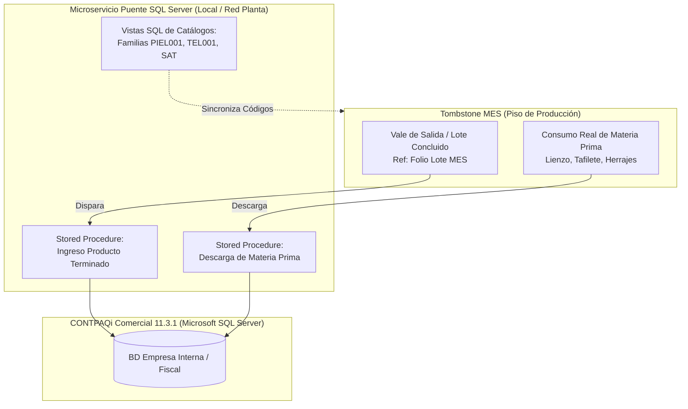

# Propuesta Técnica y Arquitectura Operativa · MES Tombstone Hats (MVP)
**Estrategia de Digitalización y Control de Manufactura · Uanify**  
*Documento de Especificación de Alcance, Procesos de Piso y Modelo Operativo.*

> **Versión Oficial:** `v2.44.0`  
> **Fecha:** 7 de Octubre de 2026  
> **Cliente:** Tombstone Hats (San Francisco del Rincón, Guanajuato)  
> **Dirección y Validación:** Edmundo González / Ing. Carlos Ortiz  
> **Líder de Proyecto:** Andrés Villanueva (Uanify)

---

## 1. Resumen Ejecutivo y Enfoque Estratégico ($0 Costo en Licenciamiento Externo)

La presente propuesta define la arquitectura, flujos operativos y alcance funcional del **Sistema MES (Manufacturing Execution System) para Tombstone Hats**, diseñado bajo el estándar industrial del Clúster Sombrerero de San Francisco del Rincón.

El sistema está enfocado en resolver las dos necesidades críticas de planta:
1. **Conocer el avance real de la orden de producción vs. lo programado.**
2. **Visualizar el inventario en proceso (WIP) actual por almacén intermedio** (dónde se encuentran físicamente los sombreros en tiempo real).

### Directrices Rectoras de la Estrategia (Solo 2 Opciones):
* **Opción A (Recomendada):** Sistema MES Integral con enlace nativo a Microsoft SQL Server de CONTPAQi Comercial 11, trazabilidad por códigos QR en tarjetas viajeras y monitoreo de WIP por almacén intermedio. Operado en tablets/pantallas táctiles utilizando la cámara integrada del dispositivo.
* **Opción B (Con Hardware de Escaneo):** Todo el alcance de la Opción A, complementado con kits de lectores ópticos industriales 2D (código QR) vía USB/Bluetooth en modo emulación teclado (HID) montados en estaciones clave para acelerar el escaneo continuo.

---

## 2. Ingesta de Órdenes, Creación de Lotes e Impresión de Tarjetas

1. **Emisión de Tarjetas Directa en Planta:**
   * El Ingeniero Admin consulta en el MES la orden proveniente de CONTPAQi Comercial.
   * Asigna manualmente la cantidad de lotes madre (base 60 pzas) y sublotes (15 pzas) conforme a la programación.
   * **Desde la misma pantalla genera e imprime las tarjetas viajeras oficiales con sus códigos QR** en hojas tamaño carta estándar de oficina para recortar e introducirlas en fundas plásticas cosidas.
2. **Fraccionamiento en Rampa (D-05):**
   * El supervisor recoge en Ingeniería el juego de tarjetas de sublote. En Rampa se realiza el cambio físico; la **Tarjeta Madre original se archiva en la mesa de rampa** como bitácora y control histórico.
3. **Escaneo de Avance:**
   * Se realiza **AL SALIR del departamento** por el usuario/supervisor que concluye el proceso al depositar en el almacén intermedio.

---

## 3. Gestión de Calidad, Piezas de Segunda y Reprocesos

1. **Estructura de Calidad y Decisión:**
   * **Inspector de Calidad:** Valida físicamente las piezas en los filtros oficiales y registra en sistema: **Aprobar** o **Rechazar**.
   * **Resolución de Rechazos (Supervisor / Ingeniero):** Ante una no conformidad, el Supervisor o Ingeniero dictamina en pantalla:
     * **Reproceso:** Selecciona manualmente en el sistema a qué estación o proceso anterior debe regresar el lote para ser corregido.
     * **Segunda:** El lote principal no se detiene; se captura la cantidad de piezas separadas y su causa raíz.
     * **Merma:** Registro de piezas descartadas definitivamente con su causa de falla.
2. **Alcance de Mermas y Segundas en MVP:**
   * Registro obligatorio del número de piezas y la **Causa Raíz** (ej. poro en lienzo, mancha de tinta, quemadura de vapor).
   * **Estrictamente Captura y Registro Histórico:** Consulta y trazabilidad para KPIs. No se incluye recosteo contable automático ni facturación especial en esta fase.

---

## 4. Módulo de Destajo y Bitácora de Paros Productivos

1. **Pre-nómina Semanal a Destajo:**
   * Cálculo automático del acumulado de piezas concluidas por operador conforme a la tarifa fija asignada ($/pza).
   * Generación de **Pre-reporte de corte los viernes** con función obligatoria de **exportación nativa a Microsoft Excel** para conciliación administrativa.
2. **Bitácora de Paros Productivos:**
   * Panel táctil con botones rápidos para registro de paro operativo: Estación/Máquina, operador, hora inicio, hora fin y motivo general.
   * *Mapeo y registro histórico:* Consulta de paros para análisis de disponibilidad. Criterios de minutos mínimos y motivos exactos por afinar con el cliente.

---

## 5. Subensambles (Tafiletes y Toquillas) y Ficha Técnica con Foto

1. **Semáforo de Buffer en Adorno:**
   * Tafiletes y Toquillas alimentan a Adorno como buffers independientes según la orden de producción.
   * La terminal de Adorno despliega un semáforo de disponibilidad por talla y modelo para evitar cuellos de botella.
2. **Ficha Técnica Visual:**
   * En Adorno e Inspección Final se muestra en pantalla la **fotografía autorizada del sombrero terminado** para confrontar físicamente armado, color, toquilla y herraje contra la muestra oficial.

---

## 6. Módulo Puente CONTPAQi Comercial 11 (Arquitectura SQL Server Validada)

Tras la reunión de validación técnica con la **Ing. Lupita López (Soporte CONTPAQi)** y **Edmundo Quezada**, se definieron los lineamientos definitivos para la conexión:

### Acuerdos Técnicos y Ventajas Estratégicas:
1. **Acceso Nativo Vía Microsoft SQL Server ($0 Costo en Licencias Adicionales):**
   * No se utiliza el SDK de CONTPAQi.
   * Se trabaja mediante Vistas y Procedimientos Almacenados (Stored Procedures) directamente sobre el motor SQL Server.
   * **Cero costo de licenciamiento:** La conexión a nivel SQL no consume usuarios concurrentes de la licencia de CONTPAQi Comercial.
2. **Manejo de Lotes Desacoplado:**
   * Como CONTPAQi no opera con trazabilidad de lotes nativa, el MES inyecta el producto terminado insertando el **Folio del Lote del MES en el campo de referencia/observaciones de la partida**.
3. **Catálogo de Materiales Estructurado:**
   * Clasificación por Familias + Consecutivo único (ej. `PIEL001` = Sintético Poring, `TEL001` = Fieltro).
   * Trazabilidad de origen ligada al Folio de Factura del Proveedor.

---

## 7. Perfiles de Acceso (3 Roles)

1. **Ingeniero (Admin Mayor):** Acceso total. Administración de órdenes, creación y partición de lotes, impresión de tarjetas viajeras, configuración de rutas, almacenes y usuarios. *(Dirección General opera con perfil Ingeniero Admin para consulta y auditoría total).*
2. **Supervisor de Planta:** Consulta de WIP de sus almacenes asignados, registro de depósito de lotes, Modo Rampa, captura de paros de máquina y resolución de reprocesos.
3. **Inspector de Calidad:** Acceso exclusivo a los filtros de calidad para aprobar o rechazar lotes.

---

## 8. Infraestructura, Conectividad y Póliza de Mantenimiento

1. **Conectividad 100% En Línea (Sin Modo Offline):**
   * El sistema requiere red Wi-Fi estable y continua en las zonas de trabajo de la nave para actualización inmediata del WIP.
2. **Administración de Infraestructura por Uanify:**
   * Uanify aloja y administra el servidor de aplicaciones, la base de datos principal y el microservicio puente SQL local.
3. **Póliza de Mantenimiento y Operación Continua:**
   * Incluye: Respaldos diarios automáticos, monitoreo de disponibilidad, optimización y mantenimiento del microservicio SQL Server CONTPAQi, y soporte técnico continuo.
   * *Operación si no se contrata póliza:* Si el cliente opta por operar de forma autónoma, se le entregan los instaladores y base de datos local, cesando los servicios administrados de respaldo y soporte de Uanify.

---

## 9. Metodología de Entrega y Cronograma (12 Semanas Totales)

| Fase | Duración | Actividades Clave |
|:---|:---:|:---|
| **Fase 1: Desarrollo e Integraciones** | 8 semanas | Construcción de módulos, vistas de almacén, terminal QR y puente SQL CONTPAQi. |
| **Fase 2: Pruebas UAT en Planta** | 1 semana | Despliegue en piso, pruebas con usuarios reales y validación de tarjetas viajeras. |
| **Fase 3: Refinamiento y Ajustes** | 2 semanas | Ajustes de ergonomía táctil, afinación de vistas y validación de descargas SQL. |
| **Fase 4: Pruebas Finales y Go-Live** | 1 semana | Puesta en marcha oficial en nave industrial y arranque productivo. |
| **TOTAL** | **12 semanas** | **Entrega formal del sistema en piso.** |

> **Garantía Post-Arranque:** **5 semanas de soporte correctivo directo** a partir del Go-Live formal en planta.

---

## 10. Modelo Comercial e Inversión

1. **Desarrollo del Sistema MES (12 semanas):**
   * *Rango de Inversión:* **[Pendiente de definir tras aprobación de módulos y diagramas de flujo]**
2. **Hardware de Piso (Opción B):**
   * Cotización de lectores ópticos 2D industriales y accesorios según estaciones requeridas.
3. **Póliza de Mantenimiento y Soporte Continuo:**
   * Cuota mensual administrada: Respaldos, monitoreo de servidor, afinación de enlace SQL y soporte a incidencias.

---

## 11. Supuestos y Exclusiones del MVP

### Supuestos Obligatorios:
1. Red local Wi-Fi con cobertura estable y continua en los puntos de almacén y calidad de la nave.
2. Servidor de CONTPAQi Comercial accesible en red local con credenciales a Microsoft SQL Server.
3. Impresora láser de oficina funcional para impresión de tarjetas en papel carta estándar.

### Exclusiones Explícitas del Alcance:
1. **Modo Offline:** No se contempla almacenamiento en desconexión.
2. **Algoritmos automáticos de optimización de corte o loteo:** La partición la define el usuario.
3. **Kárdex contable valorizado:** Se entrega bitácora física de movimientos por lote; la contabilidad de costos permanece en CONTPAQi.
4. **Pantallas Smart TV / Andon en vigas:** La visualización se concentra en tablets y PCs.
5. **Sensores IoT / Telemetría física en prensas:** El registro de paros es por captura manual táctil.
