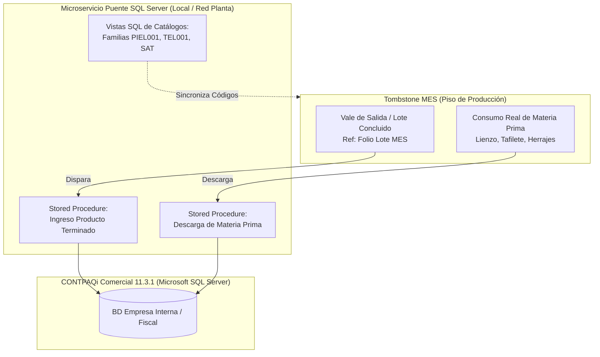

# Propuesta Técnica y Arquitectura Operativa · MES Tombstone Hats
**Estrategia de Digitalización y Control de Manufactura · Uanify**  
*Documento de Especificación de Alcance, Procesos de Piso y Modelo Operativo.*

> **Fecha:** 7 de Octubre de 2026  
> **Cliente:** Tombstone Hats (San Francisco del Rincón, Guanajuato)  
> **Líder de Proyecto:** Andrés Villanueva (Uanify)

---

## 1. Resumen Ejecutivo y Enfoque Estratégico ($0 Costo en Licenciamiento Externo)

La presente propuesta define la arquitectura, flujos operativos y alcance funcional del **Sistema MES (Manufacturing Execution System) para Tombstone Hats**.

El sistema está enfocado en resolver dos necesidades críticas de planta:
* **Conocer el avance real de la orden de producción vs. lo programado.**
* **Visualizar el inventario en proceso (WIP) actual por almacén intermedio** (dónde se encuentran físicamente los sombreros en tiempo real).

### Directrices Rectoras de la Estrategia (2 Opciones):
* **Opción A (Recomendada):** Sistema MES Integral con enlace nativo a Microsoft SQL Server de CONTPAQi Comercial 11, trazabilidad por códigos QR en tarjetas viajeras y monitoreo de WIP por almacén intermedio. Operado en tablets/pantallas táctiles utilizando la cámara integrada del dispositivo.
* **Opción B (Con Hardware de Escaneo):** Todo el alcance de la Opción A, complementado con kits de lectores ópticos industriales 2D (código QR) vía USB/Bluetooth en modo emulación teclado (HID) montados en estaciones clave para acelerar el escaneo continuo.

---

## 2. Ingesta de Órdenes, Creación de Lotes e Impresión de Tarjetas

* **Emisión de Tarjetas Directa en Planta:**  
  El Ingeniero Admin consulta en el MES la orden proveniente de CONTPAQi. Asigna manualmente la cantidad de lotes madre (base 60 pzas) y sublotes (15 pzas) conforme a la programación. Desde la misma pantalla genera e imprime las tarjetas viajeras oficiales con sus códigos QR en hojas tamaño carta para recortar e introducirlas en fundas plásticas.
* **Fraccionamiento en Rampa (D-05):**  
  El supervisor recoge en Ingeniería el juego de tarjetas de sublote. En Rampa se realiza el cambio físico; la **Tarjeta Madre original se archiva en la mesa de rampa** como bitácora y control histórico.
* **Escaneo de Avance:**  
  Se realiza al salir del departamento por el usuario/supervisor que concluye el proceso al depositar en el almacén intermedio.

---

## 3. Gestión de Calidad, Piezas de Segunda y Reprocesos

* **Estructura de Calidad y Decisión:**  
  El **Inspector de Calidad** valida físicamente las piezas en los filtros oficiales y registra en sistema: **Aprobar** o **Rechazar**. Ante una no conformidad, el Supervisor o Ingeniero dictamina en pantalla:
  * **Reproceso:** Selecciona manualmente en el sistema a qué estación o proceso anterior debe regresar el lote para ser corregido.
  * **Segunda:** El lote principal no se detiene; se captura la cantidad de piezas separadas y su causa raíz.
  * **Merma:** Registro de piezas descartadas definitivamente con su causa de falla.
* **Alcance de Mermas y Segundas en MVP:**  
  Registro obligatorio del número de piezas y la **Causa Raíz**. Estrictamente captura y registro histórico para consulta y KPIs. No se incluye recosteo contable automático ni facturación especial en esta fase.

---

## 4. Módulo de Destajo y Bitácora de Paros Productivos

* **Pre-nómina Semanal a Destajo:**  
  Cálculo automático del acumulado de piezas concluidas por operador conforme a la tarifa fija asignada ($/pza). Generación de Pre-reporte de corte con función de exportación nativa a Microsoft Excel para conciliación administrativa.
* **Bitácora de Paros Productivos:**  
  Panel para registro de paro operativo: Estación/Máquina, operador, hora inicio, hora fin y motivo general. Mapeo y registro histórico para análisis de disponibilidad.

---

## 5. Subensambles (Tafiletes y Toquillas) y Ficha Técnica con Fotos

* **Semáforo de Buffer en Adorno:**  
  Tafiletes y Toquillas alimentan a Adorno como buffers independientes según la orden de producción. La terminal de Adorno despliega un semáforo de disponibilidad por talla y modelo para evitar cuellos de botella antes de iniciar el ensamble.
* **Ficha Técnica Visual Multiperspectiva:**  
  En Adorno e Inspección Final se muestran en pantalla **varias fotografías de la muestra oficial del modelo autorizado** (diferentes ángulos de armado, detalle de toquilla, herraje, color de fieltro y doblado de falda) para confrontar físicamente el sombrero terminado contra el estándar autorizado de planta.

---

## 6. Módulo Puente CONTPAQi Comercial 11 (Arquitectura SQL Server Validada)

Tras la reunión de validación técnica con la Ing. de Soporte CONTPAQi, se definieron los lineamientos definitivos para la conexión:

### Acuerdos Técnicos y Ventajas Estratégicas:
* **Acceso Nativo Vía Microsoft SQL Server ($0 Costo en Licencias Adicionales):** No se utiliza el SDK de CONTPAQi. Se trabaja mediante Vistas y Procedimientos Almacenados directamente sobre el motor SQL Server sin consumir licencias concurrentes.
* **Manejo de Lotes Desacoplado:** El MES inyecta el producto terminado insertando el Folio del Lote del MES en el campo de referencia/observaciones de la partida.
* **Catálogo de Materiales Estructurado:** Clasificación por Familias + Consecutivo único (ej. `PIEL001` = Sintético Poring, `TEL001` = Fieltro) con trazabilidad de origen ligada al folio de factura del proveedor.

---

## 7. Perfiles de Acceso (3 Roles)

* **Ingeniero (Admin Mayor):** Acceso total. Administración de órdenes, creación y partición de lotes, impresión de tarjetas viajeras, configuración de rutas, almacenes y usuarios.
* **Supervisor de Planta:** Consulta de WIP de sus almacenes asignados, registro de depósito de lotes, Modo Rampa, captura de paros de máquina y resolución de reprocesos.
* **Inspector de Calidad:** Acceso exclusivo a los filtros de calidad para aprobar o rechazar lotes.

---

## 8. Arquitectura Cloud, Infraestructura y Costos de Operación

### 8.1 Arquitectura de Servicios en la Nube (AWS / Cloud Hosting):
Para garantizar alta disponibilidad, velocidad de respuesta en terminales y almacenamiento seguro de imágenes de fichas técnicas, la solución se despliega en una arquitectura cloud optimizada:
* **Cómputo / Servidor de Aplicación (AWS EC2 / App Service):** Instancia Linux optimizada para ejecutar el backend API del MES y servir la aplicación web a las terminales.
* **Almacenamiento de Muestras y Fichas Técnicas (AWS S3):** Bucket de almacenamiento en la nube de alta durabilidad para guardar y servir de inmediato las múltiples fotografías oficiales de alta resolución de cada sombrero.
* **Base de Datos Relacional Gestionada:** Base de datos PostgreSQL con respaldos automáticos continuos de transacciones y estados de lote.
* **Microservicio Puente LAN (Red Local Tombstone):** Servicio local ultraligero montado en el servidor Windows donde reside Microsoft SQL Server de CONTPAQi Comercial para consultar órdenes y escribir folios de producto terminado.

### 8.2 Costos Estimados de Servicios de Operación (Cloud Hosting a Cubrir por el Cliente):
Los siguientes consumos mensuales de infraestructura cloud son facturados directamente por los proveedores (ej. AWS):

| Servicio Cloud | Función en el Sistema MES | Consumo / Capacidad Estimada | Costo Estimado Mensual |
|:---|:---|:---:|:---:|
| **AWS S3 (Simple Storage Service)** | Almacenamiento seguro de fotos oficiales de muestras por modelo | Bucket con almacenamiento de 50GB a 100GB y transferencias | $5 – $12 USD / mes |
| **Cómputo Cloud (EC2 / Container)** | Servidor de aplicaciones web y APIs en alta disponibilidad | Instancia 2 vCPU, 4GB RAM con SSL e IP elástica dedicada | $22 – $38 USD / mes |
| **Base de Datos Gestionada / Backup** | PostgreSQL gestionada con snapshots automáticos diarios | Almacenamiento SSD 20GB con redundancia | $18 – $30 USD / mes |
| **Dominio y Certificados SSL** | Enlace web cifrado `mes.tombstonehats.com` para navegación segura | Certificado SSL wildcard Let's Encrypt / AWS ACM | $0 USD (Incluido) |
| **Total Estimado de Operación Cloud:** | *Consumo promedio facturado directamente a cuenta de Tombstone* | — | **$45 – $80 USD / mes** *(aprox. $900 – $1,600 MXN / mes)* |

### 8.3 Conectividad y Modalidad de Entrega:
* **Conectividad 100% En Línea (Sin Modo Offline):** El sistema requiere red Wi-Fi estable y continua en las zonas de trabajo de la nave para actualización inmediata del WIP entre almacenes.
* **Entrega Autónoma en caso de no contratar póliza:** Si el cliente decide prescindir de la póliza de soporte y mantenimiento al término del proyecto, se le entregan los recursos necesarios (código de despliegue, configuración de contenedores y scripts de base de datos) para que asuma su operación independiente sin servicios administrados de Uanify.

---

## 9. Metodología de Entrega y Cronograma (12 Semanas Totales)

| Fase | Duración | Actividades Clave |
|:---|:---:|:---|
| **Fase 1: Desarrollo e Integraciones** | 8 semanas | Construcción de módulos, vistas de almacén, terminal QR y puente SQL CONTPAQi. |
| **Fase 2: Pruebas UAT en Planta** | 1 semana | Despliegue en piso, pruebas con usuarios reales y validación de tarjetas viajeras. |
| **Fase 3: Refinamiento y Ajustes** | 2 semanas | Ajustes de ergonomía táctil, afinación de vistas y validación de descargas SQL. |
| **Fase 4: Pruebas Finales y Go-Live** | 1 semana | Puesta en marcha oficial en nave industrial y arranque productivo. |
| **TOTAL** | **12 semanas** | **Entrega formal del sistema en piso.** |

> **Garantía Post-Arranque:** **5 semanas de soporte correctivo directo** incluidas a partir del Go-Live formal en nave industrial.

---

## 10. Modelo Comercial e Inversión Estimada

### 10.1 Inversión en Desarrollo de Software (12 Semanas de Proyecto):
* **Rango de Inversión del MVP:** **[Pendiente de definir tras análisis del diagrama de flujo y catálogo de módulos]**

### 10.2 Hardware de Piso e Insumos (Estimación para 6 Estaciones de Nave):
Se presentan opciones comerciales de excelente desempeño para uso en planta:

#### A. Opciones de Tablets Industriales Recomendadas:
* **Opción 1 (Recomendada por Calidad/Precio):** **Xiaomi Redmi Pad SE 11"** (Snapdragon 680, 128GB ROM, pantalla FHD 90Hz, chasis de aluminio, Wi-Fi 5GHz de alta sensibilidad). Rendimiento extraordinario para web apps táctiles a un costo sumamente competitivo: **$3,200 – $3,600 MXN / pza**.
* **Opción 2 (Alternativa Comercial):** **Samsung Galaxy Tab A9+ 11"** (Snapdragon 695, 64GB/128GB, soporte corporativo Samsung Knox): **$4,200 – $4,800 MXN / pza**.

#### B. Modelos de Lectores Ópticos 2D Industriales (Solo Aplica para Opción B):
Para la captura inmediata de códigos QR sin depender de la cámara de la tablet, se cotizan dos modelos de alta confiabilidad en emulación teclado (HID):
* **Modelo 1 — Escáner de Pistola Inalámbrico Industrial (Netum / Tera HW-0002):** Conexión dual 2.4GHz USB + Bluetooth, lectura instantánea sobre papel y mica plástica, batería de larga duración y resistencia a caídas de 1.5m: **$1,450 – $1,850 MXN / pza**.
* **Modelo 2 — Escáner Fijo Omnidireccional de Mesa (Zebra / Eyoyo 2D Hands-Free):** Escáner de ventana fija manos libres de sobremesa; el operador pasa la tarjeta viajera por enfrente y lee a 360° sin necesidad de presionar gatillo: **$2,200 – $2,900 MXN / pza**.

#### Resumen Económico de Hardware (6 Estaciones):

| Concepto de Hardware | Especificación Técnica | Cantidad | Costo Unitario Estimado | Inversión Total Estimada |
|:---|:---|:---:|:---:|:---:|
| **Tablets de Planta (Android)** | Xiaomi Redmi Pad SE 11" (o Samsung Tab A9+) con Wi-Fi 5GHz | 6 pzas | $3,200 – $3,600 MXN | **$19,200 – $21,600 MXN** |
| **Fundas de Uso Rudo con Correa** | Carcasa antichoque de alta protección con soporte rotativo 360° | 6 pzas | $650 – $850 MXN | **$3,900 – $5,100 MXN** |
| **Soportes Articulados de Mesa** | Brazo metálico de sujeción fija para mesas de Rampa, Adorno y Prensas | 6 pzas | $750 – $950 MXN | **$4,500 – $5,700 MXN** |
| **Subtotal Hardware Base (Opción A):** | *Operación mediante cámara integrada de alta resolución* | — | — | **$27,600 – $32,400 MXN + IVA** |
| **Lectores Ópticos 2D (Solo Opción B)** | 6 Escáneres industriales 2D inalámbricos (Modelo Netum o Zebra) | 6 pzas | $1,450 – $2,200 MXN | **$8,700 – $13,200 MXN** |
| **Total Hardware Completo (Opción B):** | *Kits de Tablets Xiaomi + Soportes + Escáneres Ópticos 2D* | — | — | **$36,300 – $45,600 MXN + IVA** |

*Nota: Los equipos deben ser adquiridos directamente por Tombstone Hats bajo la ficha técnica recomendada.*

### 10.3 Póliza Opcional de Mantenimiento y Soporte Continuo (Post-Garantía):
Al concluir las **5 semanas de garantía post-arranque**, se ofrece una póliza de servicio mensual opcional para garantizar la continuidad operativa:
* **Rango de Inversión Mensual:** **$4,500 – $7,500 MXN + IVA / mes**
* **Servicios Administrados Incluidos:**
  * Respaldos diarios automáticos y cifrados de la base de datos en nube.
  * Supervisión y monitoreo de disponibilidad del servidor y red local.
  * Mantenimiento preventivo y afinación de consultas SQL al microservicio de CONTPAQi Comercial.
  * Soporte técnico correctivo ante incidencias y dudas operativas de supervisores.
  * Actualizaciones menores de seguridad y ajustes menores de flujo en terminales de piso.

---

## 11. Supuestos y Exclusiones del MVP

### Supuestos Obligatorios:
* Red local Wi-Fi con cobertura estable y continua en los puntos de almacén y calidad de la nave.
* Servidor de CONTPAQi Comercial accesible en red local con credenciales a Microsoft SQL Server.
* Impresora láser de oficina funcional para impresión de tarjetas en papel carta estándar.

### Exclusiones Explícitas del Alcance:
* **Modo Offline:** No se contempla almacenamiento en desconexión.
* **Algoritmos automáticos de optimización de corte o loteo:** La partición la define el usuario.
* **Pantallas Smart TV / Andon en vigas:** La visualización se concentra en tablets y PCs.
