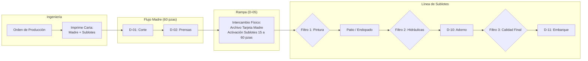

# Propuesta Técnica y Arquitectura Operativa · MES Tombstone Hats (MVP)
**Estrategia de Digitalización y Control de Manufactura · Uanify**  
*Documento de Especificación de Alcance, Procesos de Piso y Modelo Operativo.*

> **Versión Oficial:** `v2.39.0`  
> **Fecha:** 3 de Octubre de 2026  
> **Cliente:** Tombstone Hats (San Francisco del Rincón, Guanajuato)  
> **Dirección y Validación:** Edmundo González / Ing. Carlos Ortiz  
> **Líder de Proyecto:** Andrés Villanueva (Uanify)

---

## 1. Resumen Ejecutivo y Enfoque Estratégico ($0 Costo en Licenciamiento Externo)

La presente propuesta define la arquitectura, flujos operativos y alcance funcional del **Sistema MES (Manufacturing Execution System) para Tombstone Hats**, diseñado bajo el estándar industrial del Clúster Sombrerero de San Francisco del Rincón.

### Directrices Rectoras de la Estrategia:
1. **MVP Base Standalone (Independiente y Ágil):** Despliegue de piso sin dependencias bloqueantes de terceros. Control de órdenes, balanceo de línea, trazabilidad QR por tarjetas viajeras y paradas de calidad en Turno Único (meta rectora: 850 pzas/día · 4,250 pzas/semana).
2. **Extensión 1 (Módulo Puente CONTPAQi Comercial 11.3.1):** Cotizado y estructurado como un anexo modular para sincronizar compras/almacén, vales de salida oficiales y facturación, protegiendo los tiempos del despliegue inicial.
3. **Extensión 2 (Hardware de Piso e Insumos):** Soporte técnico para lectores ópticos QR vía USB/Bluetooth (emulación HID) en terminales de piso para maximizar ergonomía y velocidad frente al uso de cámaras en tablets.

---

## 2. Padrón Operativo de Planta (108 Operadores Fijos)

De acuerdo a la auditoría técnica confirmada con el Ing. Carlos Ortiz, la planta opera con personal 100% fijo en sus estaciones (sin rotación). Si un operario se ausenta, la máquina no se cubre (permanece inactiva).

| Código | Departamento / Estación | Operadores Fijos | Tipo de Compensación | Dinámica Operativa |
|:---:|:---|:---:|:---:|:---|
| **D-01** | Corte | 2 | Cuadrilla / Fijo | Preparación y corte inicial de lienzos |
| **D-02** | Prensas (Cuello de Botella) | 19 | Destajo ($/pza) | Prensado térmico por vapor; control de hormas |
| **D-03** | Endopado | 9 | Cuadrilla / Fijo | Aplicación de resinas y rigidizado de copas |
| **D-04** | Recortado | 4 | Cuadrilla / Fijo | Nivelación y corte de sobrantes de falda |
| **D-05** | Alambrado | 8 | Destajo ($/pza) | Engargolado de alambre de memoria en falda |
| **D-06** | Pintura y Acabados | 18 | Mixto | Brochas (4), Refuerzo (6), Pintura (5), Brillo (3) |
| **D-07** | Prensas Hidráulicas | 8 | Destajo ($/pza) | Planchado de falda y asentamiento final |
| **D-08** | Refaldeo | 3 | Cuadrilla / Fijo | Perfilado y rebaje de orillas |
| **D-09** | Pegado y Perforado | 4 | Destajo ($/pza) | Ojillado y preparación para herrajes |
| **D-10** | Adorno | 11 | Destajo ($/pza) | Montaje de tafilete, toquilla y herraje final |
| **D-11** | Embarque | 4 | Cuadrilla / Fijo | Empaque final en cajas y entarimado |
| **S-01** | Subensamble Tafilete | 9 | Destajo ($/pza) | Fabricación por tallas de interiores |
| **S-02** | Subensamble Toquilla | 7 | Destajo ($/pza) | Confección de cintillos exteriores por modelo |
| **ALM** | Almacén Materia Prima | 2 | Fijo | Recepción y suministro a corte |
| **CAL** | Puntos de Calidad en Línea | 6 | Inspectores Fijos | 4 filtros oficiales de inspección |
| **TOTAL** | **Nave Industrial** | **108** | — | **Personal distribuido en 14 áreas clave** |

---

## 3. Arquitectura del Flujo Productivo y Tarjetas Viajeras

### Reglas de Movimiento y Custodia Física:
1. **Emisión de Tarjetas:** Se generan e imprimen en **Ingeniería** en hojas tamaño carta estándar con códigos QR de alta densidad y se recortan para introducirlas en fundas plásticas cosidas de alta resistencia.
2. **Fraccionamiento en Rampa (D-05):** El supervisor recoge en Ingeniería el juego de tarjetas de sublote. En Rampa se realiza el cambio físico; la **Tarjeta Madre original se archiva en la mesa de rampa** como bitácora y control histórico.
3. **Escaneo de Avance:** Se realiza **AL SALIR del departamento** por el auxiliar de producción o el supervisor que concluye el proceso.
4. **Logística de Pasillo:** Los operadores dejan los sombreros en carros rodantes; un **recolector físico de pasillo** traslada las pilas (torres de 60 pzas) al almacén intermedio de la siguiente estación.

---

## 4. Gestión de Calidad, Piezas de Segunda y Reprocesos

1. **Estructura de Calidad Independiente:**
   - 6 inspectores dedicados que no dependen de la supervisión de producción, garantizando objetividad en los 4 filtros de revisión.
   - El Inspector da el visto bueno al avance del lote. Si existe una no conformidad, el **Supervisor o Ingeniero de Calidad** dictamina: *Reproceso, Merma o Segunda*.
2. **Reprocesos con Enrutamiento Específico:**
   - El lote o piezas rechazadas no regresan al paso anterior por defecto, sino que el sistema las canaliza al **departamento exacto que causó el defecto** (ej. retorno a Pintura o a Hidráulicas).
3. **Tratamiento de Piezas de Segunda (Regla Operativa Validada):**
   - **Flujo en Planta:** Las piezas de segunda detectadas se separan físicamente, pero **el lote principal NO se detiene**; continúa avanzando hasta concluir.
   - **En el Sistema MES:**
     * Registro obligatorio del número de piezas y la **Causa Raíz de Segunda** (ej. poro en lienzo, mancha de tinta, quemadura de vapor).
     * Ingreso automático a un **Inventario Virtual de Sombreros de Segunda**.
     * Físicamente se derivan a la ruta de **Venta Directa de Segundas**.

---

## 5. Módulo de Destajo y Bitácora de Paros de Máquina

1. **Pre-nómina Semanal a Destajo:**
   - Cálculo automático del acumulado de piezas buenas por operador conforme a la tarifa fija asignada ($/pza).
   - Generación de **Pre-reporte de corte los viernes** con función obligatoria de **exportación nativa a Microsoft Excel** para su conciliación con Administración.
2. **Bitácora de Paros en Prensas (Inicio a Fin):**
   - Panel táctil con botones rápidos: *Cambio de Horma, Falla Mecánica, Falta de Vapor en Caldera, Falta de Material*.
   - Mapeo diario: Qué horma de aluminio está montada en qué número de prensa para la programación de la jornada.

---

## 6. Subensambles (Tafiletes y Toquillas) y Ficha Técnica con Foto

1. **Semáforo de Buffer en Adorno:**
   - Tafiletes (9 op) y Toquillas (7 op) alimentan a Adorno (11 op) como buffers independientes.
   - La inclusión de estos elementos depende de la Orden de Producción del cliente.
   - La terminal de Adorno despliega un **semáforo de disponibilidad por talla y modelo** para evitar cuellos de botella antes de iniciar el armado.
2. **Ficha Técnica Visual:**
   - En Adorno e Inspección Final se muestra en pantalla la **fotografía autorizada del sombrero terminado** para confrontar físicamente doblado, color, toquilla y herraje contra la muestra oficial.

---

## 7. Despliegue de Hardware en Nave (6 Estaciones Confirmadas)

| Estación | Ubicación en Nave | Perfil de Terminal en Sistema | Funcionalidad Clave |
|:---:|:---|:---|:---|
| **1** | Prensas | Terminal de Formado | Control de hormas, bitácora de paros y destajo |
| **2** | Calidad Refuerzo / Pintura | Terminal de Filtro 1 | Aprobación de calidad y desvío a reprocesos |
| **3** | Patio Endopado / Recortes | Terminal de Proceso Seco | Registro de avance y tiempos de curado |
| **4** | Calidad Prensas Hidráulicas | Terminal de Filtro 2 | Inspección de planchado y falda |
| **5** | Toquilla y Adorno | Terminal de Acabados | Semáforo de subensambles y Ficha con Foto |
| **6** | Calidad Final y Embarque | Terminal de Despacho | Filtro 3, captura de segundas y Vale de Salida |

---

## 8. Sincronización y Mantenimiento de Documentación

Conforme a las directrices de Uanify, este documento se mantiene sincronizado de forma continua entre el repositorio de control de versiones y la suite de Google Workspace de la empresa, garantizando una fuente única de verdad para Dirección, Ingeniería y el equipo de desarrollo.
