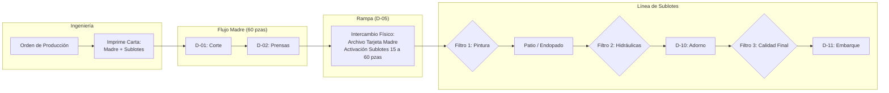
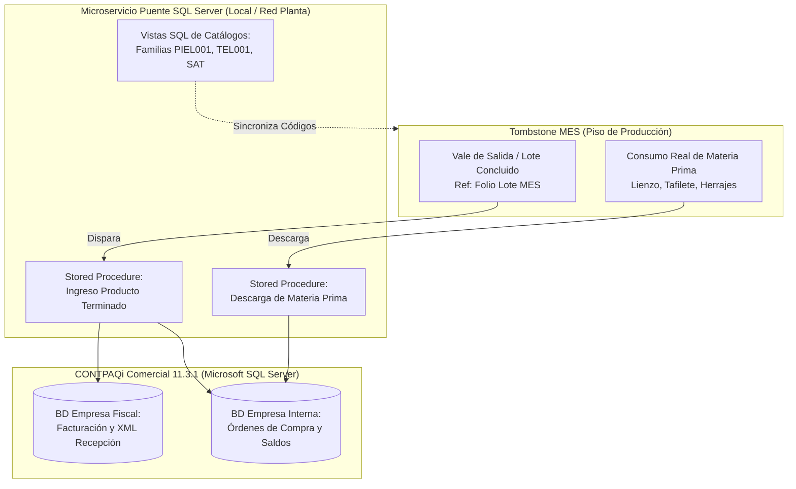

# Propuesta Técnica y Arquitectura Operativa · MES Tombstone Hats (MVP)
**Estrategia de Digitalización y Control de Manufactura · Uanify**  
*Documento de Especificación de Alcance, Procesos de Piso y Modelo Operativo.*

> **Versión Oficial:** `v2.41.0`  
> **Fecha:** 4 de Octubre de 2026  
> **Cliente:** Tombstone Hats (San Francisco del Rincón, Guanajuato)  
> **Dirección y Validación:** Edmundo González / Ing. Carlos Ortiz  
> **Líder de Proyecto:** Andrés Villanueva (Uanify)

---

## 1. Resumen Ejecutivo y Enfoque Estratégico ($0 Costo en Licenciamiento Externo)

La presente propuesta define la arquitectura, flujos operativos y alcance funcional del **Sistema MES (Manufacturing Execution System) para Tombstone Hats**, diseñado bajo el estándar industrial del Clúster Sombrerero de San Francisco del Rincón.

### Directrices Rectoras de la Estrategia:
1. **MVP Base Standalone (Independiente y Ágil):** Despliegue de piso sin dependencias bloqueantes de terceros. Control de órdenes, balanceo de línea, trazabilidad QR por tarjetas viajeras y paradas de calidad en Turno Único (meta rectora: 850 pzas/día · 4,250 pzas/semana).
2. **Extensión 1 (Módulo Puente CONTPAQi Comercial 11.3.1):** Cotizado y estructurado como un anexo modular para sincronizar compras/almacén, vales de salida oficiales y facturación, protegiendo los tiempos del despliegue inicial.
3. **Extensión 2 (Hardware de Piso e Insumos):** Soporte técnico para lectores ópticos QR vía USB/Bluetooth (emulación HID) en terminales de piso para maximizar ergonomía y velocidad frente al uso de cámaras en tablets.

---

## 2. Padrón Operativo de Planta (108 Operadores Fijos)

De acuerdo a la auditoría técnica confirmada con el Ing. Carlos Ortiz, la planta opera con personal 100% fijo en sus estaciones (sin rotación). Si un operario se ausenta, la máquina no se cubre (permanece inactiva).

| Código | Departamento / Estación | Operadores Fijos | Tipo de Compensación | Dinámica Operativa |
|:---:|:---|:---:|:---:|:---|
| **D-01** | Corte | 2 | Cuadrilla / Fijo | Preparación y corte inicial de lienzos |
| **D-02** | Prensas (Cuello de Botella) | 19 | Destajo ($/pza) | Prensado térmico por vapor; control de hormas |
| **D-03** | Endopado | 9 | Cuadrilla / Fijo | Aplicación de resinas y rigidizado de copas |
| **D-04** | Recortado | 4 | Cuadrilla / Fijo | Nivelación y corte de sobrantes de falda |
| **D-05** | Alambrado | 8 | Destajo ($/pza) | Engargolado de alambre de memoria en falda |
| **D-06** | Pintura y Acabados | 18 | Mixto | Brochas (4), Refuerzo (6), Pintura (5), Brillo (3) |
| **D-07** | Prensas Hidráulicas | 8 | Destajo ($/pza) | Planchado de falda y asentamiento final |
| **D-08** | Refaldeo | 3 | Cuadrilla / Fijo | Perfilado y rebaje de orillas |
| **D-09** | Pegado y Perforado | 4 | Destajo ($/pza) | Ojillado y preparación para herrajes |
| **D-10** | Adorno | 11 | Destajo ($/pza) | Montaje de tafilete, toquilla y herraje final |
| **D-11** | Embarque | 4 | Cuadrilla / Fijo | Empaque final en cajas y entarimado |
| **S-01** | Subensamble Tafilete | 9 | Destajo ($/pza) | Fabricación por tallas de interiores |
| **S-02** | Subensamble Toquilla | 7 | Destajo ($/pza) | Confección de cintillos exteriores por modelo |
| **ALM** | Almacén Materia Prima | 2 | Fijo | Recepción y suministro a corte |
| **CAL** | Puntos de Calidad en Línea | 6 | Inspectores Fijos | 4 filtros oficiales de inspección |
| **TOTAL** | **Nave Industrial** | **108** | — | **Personal distribuido en 14 áreas clave** |

---

## 3. Arquitectura del Flujo Productivo y Tarjetas Viajeras

### Reglas de Movimiento y Custodia Física:
1. **Emisión de Tarjetas:** Se generan e imprimen en **Ingeniería** en hojas tamaño carta estándar con códigos QR de alta densidad y se recortan para introducirlas en fundas plásticas cosidas de alta resistencia.
2. **Fraccionamiento en Rampa (D-05):** El supervisor recoge en Ingeniería el juego de tarjetas de sublote. En Rampa se realiza el cambio físico; la **Tarjeta Madre original se archiva en la mesa de rampa** como bitácora y control histórico.
3. **Escaneo de Avance:** Se realiza **AL SALIR del departamento** por el auxiliar de producción o el supervisor que concluye el proceso.
4. **Logística de Pasillo:** Los operadores dejan los sombreros en carros rodantes; un **recolector físico de pasillo** traslada las pilas (torres de 60 pzas) al almacén intermedio de la siguiente estación.

---

## 4. Gestión de Calidad, Piezas de Segunda y Reprocesos

1. **Estructura de Calidad Independiente:**
   - 6 inspectores dedicados que no dependen de la supervisión de producción, garantizando objetividad en los 4 filtros de revisión.
   - El Inspector da el visto bueno al avance del lote. Si existe una no conformidad, el **Supervisor o Ingeniero de Calidad** dictamina: *Reproceso, Merma o Segunda*.
2. **Reprocesos con Enrutamiento Específico:**
   - El lote o piezas rechazadas no regresan al paso anterior por defecto, sino que el sistema las canaliza al **departamento exacto que causó el defecto** (ej. retorno a Pintura o a Hidráulicas).
3. **Tratamiento de Piezas de Segunda (Regla Operativa Validada):**
   - **Flujo en Planta:** Las piezas de segunda detectadas se separan físicamente, pero **el lote principal NO se detiene**; continúa avanzando hasta concluir.
   - **En el Sistema MES:**
     * Registro obligatorio del número de piezas y la **Causa Raíz de Segunda** (ej. poro en lienzo, mancha de tinta, quemadura de vapor).
     * Ingreso automático a un **Inventario Virtual de Sombreros de Segunda**.
     * Físicamente se derivan a la ruta de **Venta Directa de Segundas**.

---

## 5. Módulo de Destajo y Bitácora de Paros de Máquina

1. **Pre-nómina Semanal a Destajo:**
   - Cálculo automático del acumulado de piezas buenas por operador conforme a la tarifa fija asignada ($/pza).
   - Generación de **Pre-reporte de corte los viernes** con función obligatoria de **exportación nativa a Microsoft Excel** para su conciliación con Administración.
2. **Bitácora de Paros en Prensas (Inicio a Fin):**
   - Panel táctil con botones rápidos: *Cambio de Horma, Falla Mecánica, Falta de Vapor en Caldera, Falta de Material*.
   - Mapeo diario: Qué horma de aluminio está montada en qué número de prensa para la programación de la jornada.

---

## 6. Subensambles (Tafiletes y Toquillas) y Ficha Técnica con Foto

1. **Semáforo de Buffer en Adorno:**
   - Tafiletes (9 op) y Toquillas (7 op) alimentan a Adorno (11 op) como buffers independientes.
   - La inclusión de estos elementos depende de la Orden de Producción del cliente.
   - La terminal de Adorno despliega un **semáforo de disponibilidad por talla y modelo** para evitar cuellos de botella antes de iniciar el armado.
2. **Ficha Técnica Visual:**
   - En Adorno e Inspección Final se muestra en pantalla la **fotografía autorizada del sombrero terminado** para confrontar físicamente doblado, color, toquilla y herraje contra la muestra oficial.

---

## 7. Despliegue de Hardware en Nave (6 Estaciones Confirmadas)

| Estación | Ubicación en Nave | Perfil de Terminal en Sistema | Funcionalidad Clave |
|:---:|:---|:---|:---|
| **1** | Prensas | Terminal de Formado | Control de hormas, bitácora de paros y destajo |
| **2** | Calidad Refuerzo / Pintura | Terminal de Filtro 1 | Aprobación de calidad y desvío a reprocesos |
| **3** | Patio Endopado / Recortes | Terminal de Proceso Seco | Registro de avance y tiempos de curado |
| **4** | Calidad Prensas Hidráulicas | Terminal de Filtro 2 | Inspección de planchado y falda |
| **5** | Toquilla y Adorno | Terminal de Acabados | Semáforo de subensambles y Ficha con Foto |
| **6** | Calidad Final y Embarque | Terminal de Despacho | Filtro 3, captura de segundas y Vale de Salida |

---

## 8. Extensión 1: Módulo Puente CONTPAQi Comercial 11 (Arquitectura SQL Server Validada)

Tras la reunión de validación técnica con la **Ing. Lupita López (Soporte CONTPAQi)** y **Edmundo Quezada**, se definieron los lineamientos definitivos para la conexión:

### Acuerdos Técnicos y Ventajas Estratégicas:
1. **Acceso Nativo Vía Microsoft SQL Server ($0 Costo en Licencias Adicionales):**
   - No se utiliza el SDK de CONTPAQi (evitando restricciones, bloqueos e inestabilidad).
   - Se trabaja mediante **Vistas y Procedimientos Almacenados (Stored Procedures)** directamente sobre el motor de base de datos SQL Server.
   - **Cero costo de licenciamiento:** La conexión a nivel SQL no consume usuarios concurrentes de la licencia de CONTPAQi Comercial.
2. **Esquema de Dos Bases de Datos (Razón Social Interna vs. Fiscal):**
   - **Base de Datos Interna:** Control de órdenes de compra abiertas y seguimiento a parcialidades del proveedor mediante vales internos.
   - **Base de Datos Fiscal:** Registro exacto de mercancía recibida físicamente con asociación directa a los XML de los proveedores.
3. **Manejo de Lotes Desacoplado:**
   - Como CONTPAQi no opera con trazabilidad de lotes nativa, el MES inyecta el producto terminado insertando el **Folio del Lote del MES en el campo de referencia/observaciones de la partida**, permitiendo que Administración facture de forma habitual con plena trazabilidad hacia atrás.
4. **Catálogo de Materiales Estructurado:**
   - Clasificación por Familias + Consecutivo único (ej. `PIEL001` = Sintético Poring, `TEL001` = Fieltro).
   - Atributos sincronizados: *Código, Nombre, Categoría, Almacén, Clave SAT, Unidad de Medida y Costo Unitario*.
   - Trazabilidad de origen ligada al **Folio de Factura del Proveedor**.

---

## 9. Metodología de Entrega y Cronograma (5 a 7 Semanas)

1. **Plazo Oficial de Implementación del MVP:**
   - Se establece un cronograma ágil de **5 a 7 semanas** para la puesta en marcha en piso (sustituyendo el planteamiento teórico de 16 semanas para asegurar tracción rápida).
2. **Ciclos de Entrega y Demos Funcionales:**
   - **Sprints de 2 semanas:** Demostraciones quincenales en piso con usuarios reales (supervisores e inspectores) para retroalimentación continua.
3. **Product Owner y Contraparte Técnica:**
   - **Ing. Carlos Ortiz** (Ingeniería de Procesos) funge como contraparte técnica y Product Owner de planta por parte de Tombstone Hats.

---

## 10. Arquitectura Tecnológica e Infraestructura

1. **Tipo de Aplicación:**
   - **PWA (Progressive Web App) Tablet-First:** Permite instalación táctil como aplicación de pantalla completa en tablets Android sin fricción de tiendas de apps ni costos de despliegue.
2. **Infraestructura y Base de Datos ($0 USD Inicial):**
   - Servidor web/API en la nube y base de datos relacional PostgreSQL con tier gratuito, complementado con el microservicio puente en red local LAN para conectar la base de datos Microsoft SQL Server de CONTPAQi.
3. **Resiliencia Operativa Offline-First:**
   - Almacenamiento local en tablets (`IndexedDB` y `localStorage`) para que ningún supervisor se detenga por micro-cortes de red Wi-Fi; sincronización automática en cola al reconectar.
4. **Propiedad de Infraestructura:**
   - Todas las cuentas, bases de datos, repositorios y códigos quedan a nombre de Tombstone Hats o bajo su custodia corporativa.

---

## 11. Modelo Comercial, Inversión y Soporte

1. **Rango de Inversión del MVP Base:**
   - Inversión de desarrollo: **$76,000 – $109,000 MXN + IVA** (desarrollo ágil de 5 a 7 semanas).
2. **Garantía Post-Arranque:**
   - **30 días naturales de garantía y soporte correctivo directo** incluidos a partir del Go-Live formal en planta.
3. **Póliza de Mantenimiento y Evolución Continua:**
   - Propuesta opcional post-garantía: **$3,500 – $6,000 MXN/mes** (incluye soporte técnico preventivo, optimización de consultas SQL con CONTPAQi y ajustes menores de flujo).

---

## 12. Matriz de Respuestas a Puntos de Decisión Técnica

| # | Punto de Decisión | Definición Oficial Acordada | Impacto en Sistema |
|:---:|:---|:---|:---|
| **1.1** | **Líneas de Producto** | Exclusivamente **Línea de Sombreros** en Fase 1 (MVP). Accesorios (cintos, carteras) quedan para Fase 2. | Catálogo centrado en modelos texanos y campanas. |
| **1.2** | **Gestión de Pedidos & Stock** | Incluido en MVP: Órdenes por cliente, desglose de modelos y stock meta. | Módulo de Órdenes y sincronización de vales B2B. |
| **1.3** | **Compras e Insumos** | Control de recepción de rollos e insumos mediante el puente CONTPAQi Comercial SQL Server. | Tablas nativas `mgw10005` y `mgw10008` enlazadas. |
| **1.4** | **Metas & Cadencia** | Turno Único (07:00 a 15:30) con meta semanal de **4,250 pzas** (~850 pzas/día) y Takt Time de **42s**. | Curva hora por hora y semáforos Andon en vivo. |
| **1.5** | **Vales de Salida** | Generación de **Vale Digital de Salida** con descuento automático de piezas concluidas. | Base para timbrado y facturación en CONTPAQi. |
| **2.1** | **Estructura de Lotes** | Lotes madre dinámicos (base 60 pzas) fraccionados en sublotes de 15 pzas (editables por orden de 4 a 14 sublotes). | Lotes madre y sublotes en micas viajeras. |
| **2.2** | **Fraccionamiento en Rampa** | En Rampa (D-05) mediante activación formal en tablet. La tarjeta madre se archiva como histórico. | Botón heroico "Modo Rampa" en Terminal. |
| **2.3** | **Calidad y Mermas** | 4 filtros de calidad con 6 inspectores. Segundas se venden directamente; el lote no se detiene. | Segregación de segundas y enrutamiento a causa raíz. |
| **2.4** | **Destajo por Operador** | 108 operadores fijos. Pre-reporte semanal de corte de los viernes ($/pza) con exportación a Excel. | Módulo de cálculo y botón de descarga CSV/Excel. |
| **2.5** | **Almacenes Intermedios** | Monitoreo en vivo de WIP por estación y buffers de salida entre departamentos. | Tablero Andon y monitores de rampa en tiempo real. |
| **3.1** | **Perfiles de Acceso** | RBAC con 4 roles: Admin (Edmundo), Ingeniero (Carlos), Supervisor (Nave) e Inspectores de Calidad. | Seguridad modular con ocultamiento total de pestañas. |
| **3.2** | **Autenticación en Piso** | Teclado numérico táctil de **PIN rápido de 4 dígitos** (más selector rápido de perfiles). | Cero contraseñas complejas que frenen el paso. |
| **3.3** | **Auditoría & Trazabilidad** | Firma digital automática (usuario, estación, lote, piezas, fecha y hora exacta). | Kárdex cronológico y bitácora de movimientos. |
| **4.1** | **Tipo de Aplicación** | PWA (Progressive Web App) responsiva optimizada Tablet-First. | Acceso universal vía navegador sin tiendas. |
| **4.2** | **Infraestructura** | Servidor en la nube con base de datos PostgreSQL ($0 tier) + microservicio local para SQL Server. | Arquitectura híbrida sin costo de licenciamiento. |
| **4.3** | **Modo Offline** | Resiliencia offline mediante almacenamiento local en navegador (`IndexedDB`). | Continuidad de escaneo ante caídas de Wi-Fi. |
| **4.4** | **Enlace CONTPAQi** | Enlace nativo vía Vistas y Stored Procedures en Microsoft SQL Server ($0 USD licencias). | Cero dependencia de licencias concurrentes ni SDK. |
| **5.1** | **Modelo de Tablets** | Tablets comerciales (Samsung Tab A9+ 11" / Xiaomi Pad) con funda rígida sellada de uso rudo. | Inversión eficiente sin sobrecosto de hardware militar. |
| **5.2** | **Despliegue de Tablets** | Despliegue en las **6 estaciones clave** de piso (Prensas, 3 Filtros Calidad, Patio, Adorno). | Cobertura integral de los puntos de control de nave. |
| **5.3** | **Pantallas Andon** | Visualización en tablets y PCs en Fase 1. Pantallas físicas Smart TV en viga pausadas para Fase 2. | $0 costo anticipado en cableado o pantallas de TV. |
| **5.4** | **Impresora de Tarjetas** | Impresora láser de oficina en **Ingeniería en hoja tamaño carta estándar** recortable para micas. | Utilización de infraestructura de impresión existente. |

---

## 13. Sincronización y Mantenimiento de Documentación

Conforme a la **REGLA 0.4.1** de desarrollo, este documento se mantiene estrictamente sincronizado de forma automática entre el repositorio de código y la suite de Google Workspace de la empresa (`Tombstone Hats`), garantizando una fuente única de verdad para Dirección, Ingeniería y Uanify.

